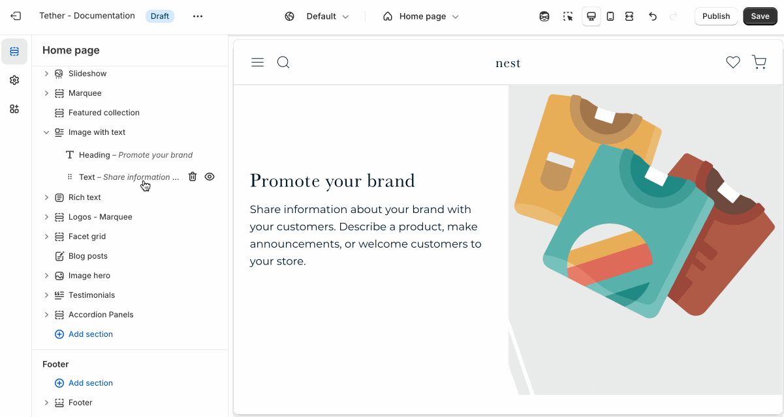

# Buttons

The Buttons block lets you add one or more call-to-action buttons anywhere in your section. Use it to guide customers to key pages like product collections, contact forms, or external links.

## Adding the block

Add the Buttons block to your section blocks using the Theme Editor.

:::info

The buttons block is technically a container that allows you to add nested "Button" blocks. This ensures multiple buttons do not stack on top of each other if space permits.

Add a "Buttons" block, followed by a "Button" block within the container block.

:::

## Adding a nested Button block

The "Button" block is a descendant of the Buttons container. Add Button blocks as nested blocks to the Buttons block.

## Customize your button

The Button block includes the following customizations:

1. Label
2. Link
3. Size
4. Style

Customize the button’s size and style to complement your design and draw attention where it matters.

