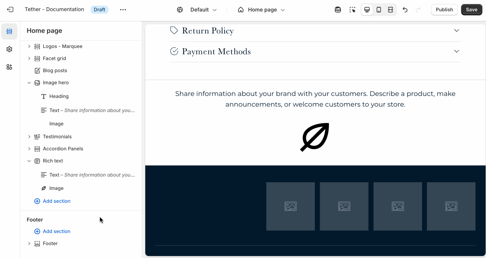
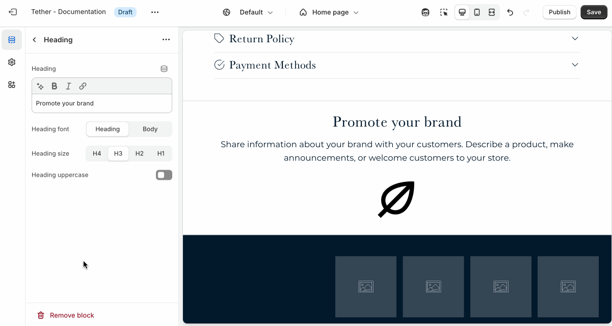

# Heading

Use the Heading block to add titles to your section. Headings help organize your content, and make it easier to scan.

:::tip

A well-placed heading helps guide customers and make your content feel structured and intentional.

:::

## Adding the block

Add the Heading block to your section blocks using the Theme Editor.

## Customize your heading

The Heading block includes the following customizations:

1. Heading text
2. Font
3. Size
4. Uppercase

Customize the text, size, and style of your heading to match your design. Choose between your theme’s body or heading font, adjust the font size, and optionally display the text in all caps for extra emphasis.

:::note

You can use Shopify's rich text editor to further customize your heading:

* Bold parts of your heading.
* Italisize specific words.
* Add text links.

:::
