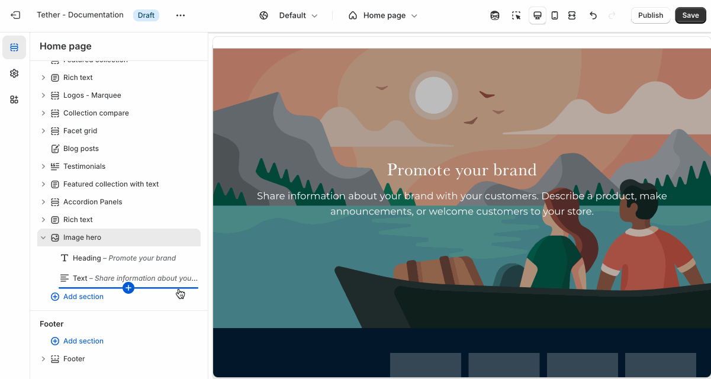
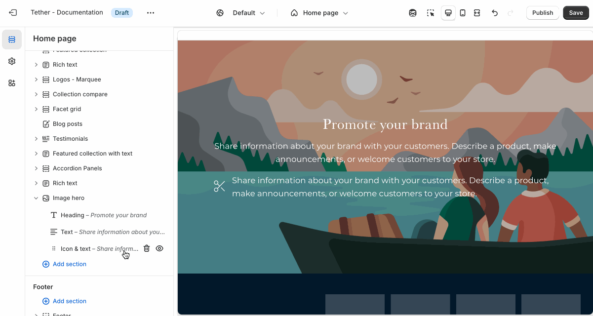

# Icon and text

Use the Icon and Text block to pair a visual icon with supporting text. Perfect for highlighting features, services, or key details in a simple, scannable format.

:::tip

Many sections allow you to control the container width. This will adjust the width inner content including the Icon and text block.

:::

## Adding the block

Add the Icon and text block to your section blocks using the Theme Editor.

## Customize your image

The Image block includes the following customizations:

1. Icon position
2. Icon
3. Icon max width
4. Text
5. Text size

Choose the icon, adjust its size, and control its placement to align with your layout and messaging.

