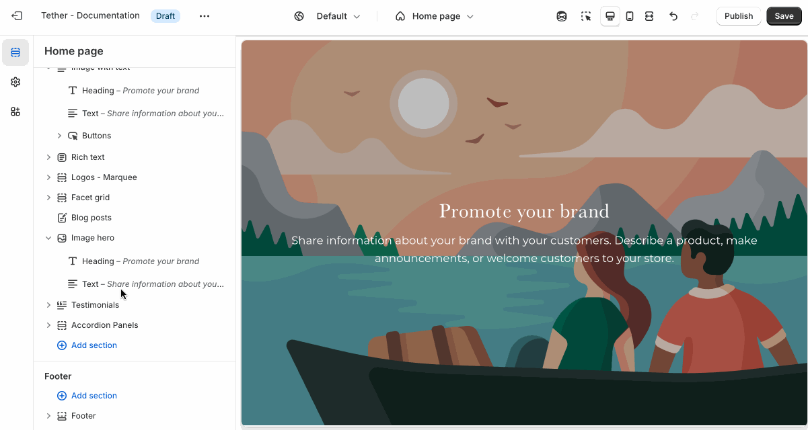
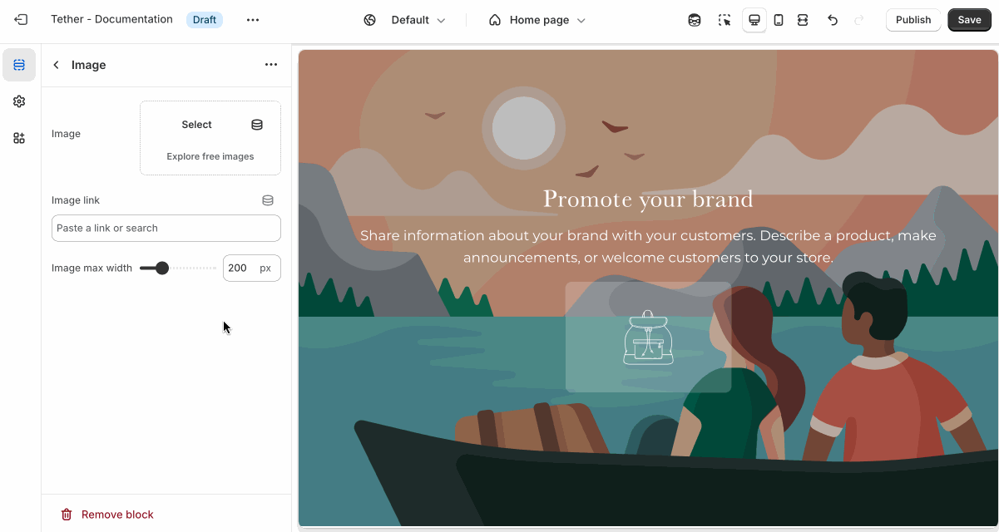

# Image

Use the Image block to add a standalone image in your sections. It's great for showcasing your branding, highlighting promotions, or linking to affiliate content.

:::tip

Common uses include:

* Displaying brand logos or badges
* Linking to partner sites or external pages

:::

## Adding the block

Add the Image block to your section blocks using the Theme Editor.

## Customize your image

The Image block includes the following customizations:

1. Image
2. Link
3. Max width

Control the image size using the max width setting, and optionally make the image clickable by adding a link.

