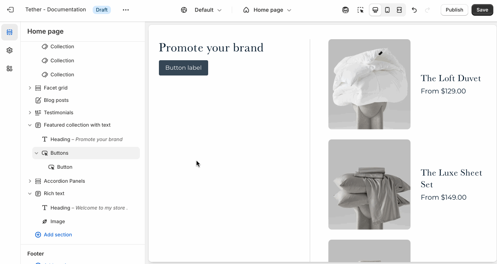
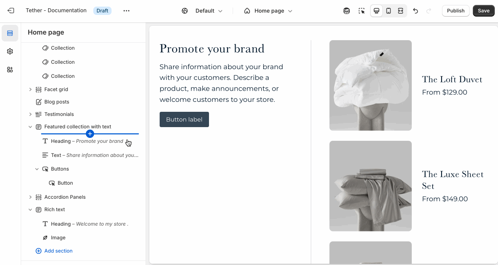

# Text

Use the Text block to add short messages, descriptions, or supporting content to your section. Great for  highlighting offers, or sharing additional details.

## Adding the block

Add the Text block to your section blocks using the Theme Editor.

## Customize your text

The Text block includes the following customizations:

1. Text
2. Text size

Customize the text, and size of your text to match your design.

:::note

You can use Shopify's rich text editor to further customize your text:

* Add inline headings to your text content. (Due to potential SEO issues this is not advised).
* Bold parts of your text.
* Italisize specific words.
* Add text links.
* Add ordered or unordered lists

:::
