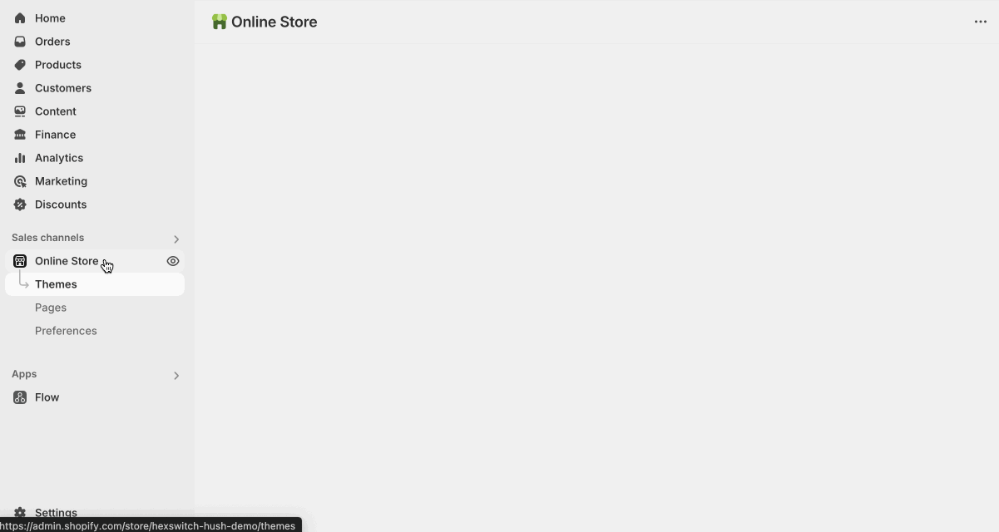

# Editing your theme

Your Shopify theme is built to be flexible and easy to personalize.

To customize your theme, use the Shopify Theme Editor. You can easily add, remove, and rearrange sections and blocks to build your pages. For a deep dive into how the Theme Editor works, refer to the official [Shopify documentation.](https://help.shopify.com/en/manual/online-store/themes/customizing-themes).

## Using the theme editor

1. Go to your Shopify Admin.
2. Click Online Store → Themes.
3. Find your theme and click Customize.

:::tip

## Published theme

The first theme in your theme list which displays large preview images is your published theme. This is the theme that is visible to visitors of your your.

The themes below are your unpublished themes. These are not visible to visitors in any way. Using unpublished themes is a great way to test content and new layouts without commiting to those changes before perfecting them.

:::
