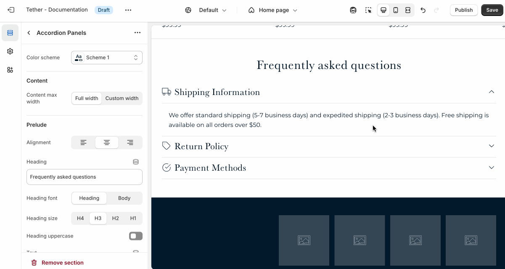

### Content container

These settings control the width and alignment of the content within the section.

| Setting                          | Description |
|----------------------------------|-------------|
| **Content max width**            | Choose whether the content spans the full width of the section, or use a custom width. |
| **Custom width**                 | When "Custom width" is selected, this sets the maximum content width in pixels. |
| **Custom width container alignment** | Controls how the custom-width content is aligned within the section: left, center, or right. |

  
Visual example.

  

