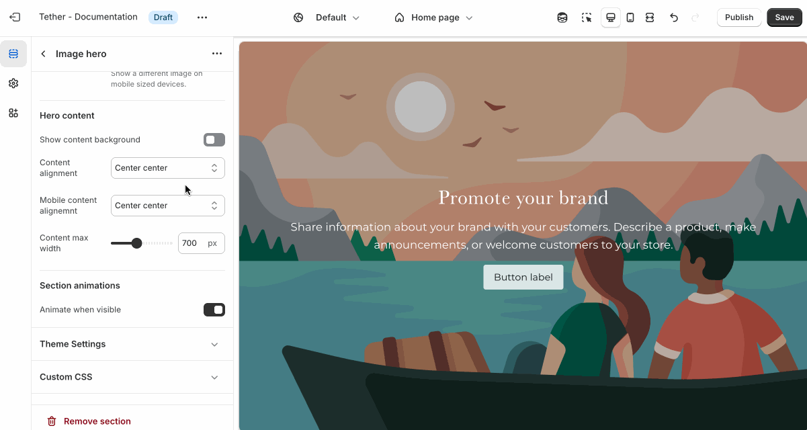

### Overlay content

Overlay content settings control how text, buttons, and other elements appear on top of media. These settings allow you to adjust positioning, layout, and readability.

| Setting                       | Description |
|-------------------------------|-------------|
| **Show content background**   | When enabled, displays a background behind text content, using the selected 'Content background color scheme' colors. Helps improve readability over images. |
| **Content background color scheme**   | Select a predefined color scheme for your content and content background. Only applies if 'Show content background' is enabled. |
| **Show background gradient**   | Show your predefined background gradient associated with the selected 'Content background color scheme'. Only applies if 'Show content background' is enabled.. |
| **Content alignment**         | Controls the position of inner content blocks. |
| **Mobile content alignment**  | Adjusts content positioning specifically for mobile devices. |
| **Content max width**         | Sets the maximum width (in pixels) of the text content area. Useful for limiting line length and improving visual layout. |

  
Visual example.

  

