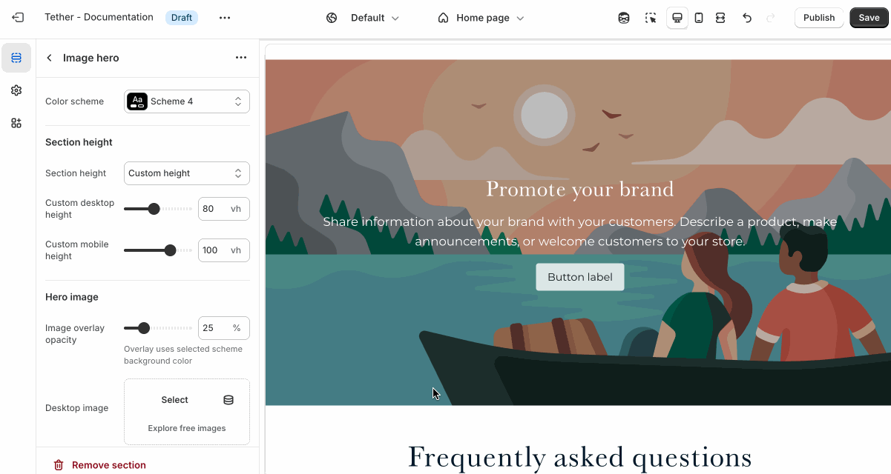

### Section height

Your choice between a custom height or using the sections media height will determine the total height of the section.

| Setting               | Description                                                                 |
|------------------------|-----------------------------------------------------------------------------|
| **Section height**         | Select between {props.heightLabel} height or a custom height.                       |
| **Custom desktop height**  | Set a specific height for the section on desktop screens, in viewport height (`vh`). Only applies if Section height is set to 'Custom height'       |
| **Custom mobile height**   | Same as above applying to mobile screens.        |

