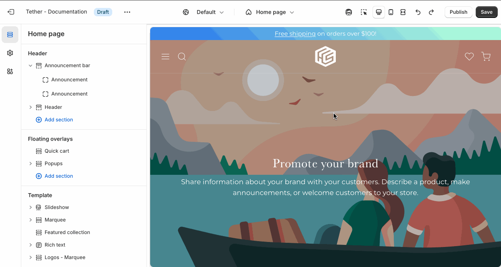

# Announcement bar

Display important messages at the top of your store with the Announcement Bar. Add multiple announcements and choose between a scrolling ticker or sliding carousel to catch your customers’ attention. Great for promotions, shipping info, or store updates.

## Settings

Adjust the announcement bar size, and pick between scroll or rotate adventment styles.

### Rotate advancement

The rotate advancement style is similar to a sliding carousel. Slides auto rotate unless a user has interacted with the announcement bar.

Control the speed at which announcement rotate using the "Rotate every" range setting. This number is applied as seconds. If set to 6s the announcements will rotate every 6 seconds, unless interacted with.

### Scroll advancement

The scroll advencement style is similar to the Marquee section. The scroller will pause when a user has hovered over it.

Control the scroll speed using the "Scroll speed" range setting.

:::note

The scroll speed is calculated using a fairly complex math equation that factors the amount of content within a marquee scroller and how much width the content takes.

You may need to adjust the scroll speed after altering your content.
:::

## Customizing your announcement blocks

Pick your Color scheme and set your content.

:::tip
Annoucements include the "Show background gradient" setting. Add a pop of color to really bring attention to your stores visitors.
:::

## Removing the announcement bar

If you don't have anything to announce or prefer a more minimal header feel free to hide the announcement bar.

To hide the announcement bar use the "eye" icon, or remove all announcement blocks. 

