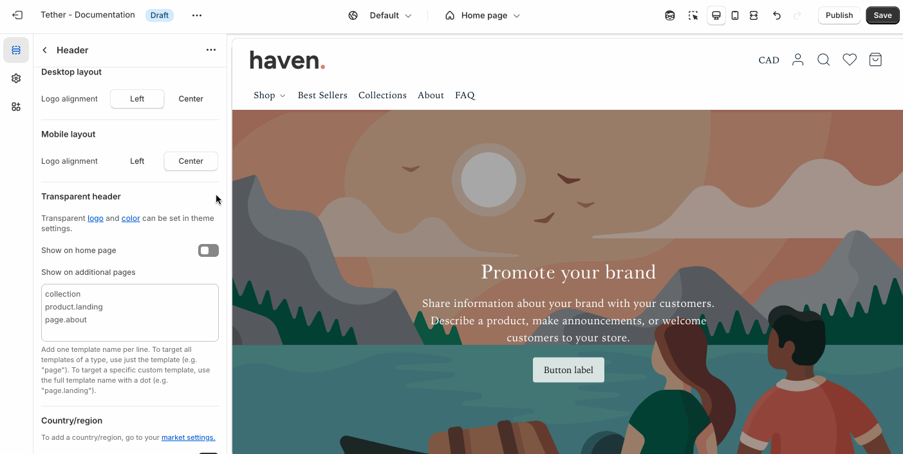

# Header

The header appears at the top of every page and helps customers navigate your store.

## Settings

| Setting               | Description                                                                 |
|------------------------|-----------------------------------------------------------------------------|
| **Header display mode**         | Determines how the header behaves while scrolling. Choose between Static, always visible (Sticky), or only visible when scrolling up. (Sticky on scroll up) |
| **Cart icon**         | Choose whether to display the cart icon as a shopping bag or a shopping cart. |
| **Show border** + **Associated settings**         | Optionally show a bottom border, control the width, color, and opacity of the bottom border.  |
| **Navigation**         | [See all Navigation settings](#navigation-settings) |
| **Desktop logo alignment**         | Set the alignment of your logo on desktop to either the left or center within the header. |
| **Mobile logo alignment**         | Set the alignment of your logo on desktop to either the left or center within the header. |
| **Transparent header**         | [See all Transparent header settings](#transparent-header-settings) |
| **Country/region selector**         | Show a Country / region selector button allowing merchants to change their selected country and currency. |
| **Show language selector**         | Show a Language language button allowing merchants to change their selected language. |
| **Show social icons**         | Show an icon list of your social media links within the menu drawer. |

## Navigation settings

| Setting               | Description                                                                 |
|------------------------|-----------------------------------------------------------------------------|
| **Menu**         | Choose which menu you want to display as the main navigation within the header. |
| **Desktop navigation display**         | Choose how to display your navigation as visible links or behind a drawer-style menu icon. |
| **Navigation position**         | Display your visible links navigation inline or below the header. |
| **Navigation text size**         | Adjust the navigation font size. |
| **Submenu icon**         | Choose between `plus - +` or `chevron - >` to indicate menu items can open to drawer menus or mega menus. |

## Transparent header settings

Display the header as transparent overlaying the first section on the page.

Transparent color scheme and logo should be set within the the theme settings.

| Setting               | Description                                                                 |
|------------------------|-----------------------------------------------------------------------------|
| **Show on home page**         | Display the header as transparent on the homepage. |
| **Show on additional pages**         | Enable the transparent header on pages beyond the homepage. If using template pages use the page type followed by the template name: `page.summer-sale-landing`. |

:::tip
Transparent headers look the best on top of full width sections like:

* Image hero
* Newsletter signup
* Slideshow
* Split hero
* Video hero

:::

## Block - Mega menu

Create a large, multi-column dropdown menu for easier navigation.

| Setting               | Description                                                                 |
|------------------------|-----------------------------------------------------------------------------|
| **Menu position**         | Choose which link based on numerical position you want the Mega menu to be associated with. |
| **Show in drawer menu**         | Show the associated promotional items in the drawer menu when interacting with the specified link. |
| **Promotion color scheme**         | Set a predifined color scheme for your promotions. Applies to overlay content. |
| **Promotion image aspect ratio**         |  Control the aspect ratio of the mobile image. |
| **Promotion 1 / 2**         | Select an image, add overlay text, and customizing its style. Link the image to a product, collection, or page to drive traffic. Adjust the overlay opacity to ensure your text remains readable, and fine-tune the font and text size to match your design. Ideal for highlighting featured products, sales, or seasonal messaging within a grid or banner layout. |

