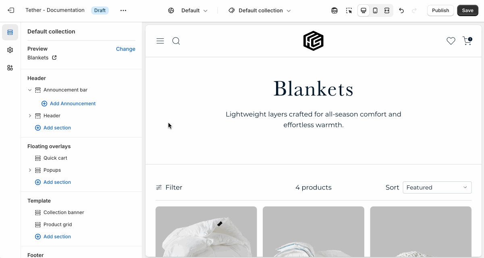

# Quick cart

The Quick Cart lets customers view and manage their cart without leaving the page. It can be opened from the Header cart button or automatically when a product is added, creating a faster and more seamless shopping experience.

## Settings

Control the visibility of the Quick Cart and choose where to display the free shipping bar. These settings help you fine-tune how the cart appears and communicates incentives to your customers.

:::note
The quick cart shares some fundamental settings with the Cart Template. Additional Cart related settings can be found in [Theme settings > Cart](#TODO)
:::

:::tip
If the quick cart is disabled the following cart interactions will change:

1. Clicking on Header the cart button will redirect a user to the Cart Template.
2. Adding a product to your cart from a product card will visually update the cart count.
3. Adding a product to your cart from the product page will redirect the user to the Cart Template.

:::
