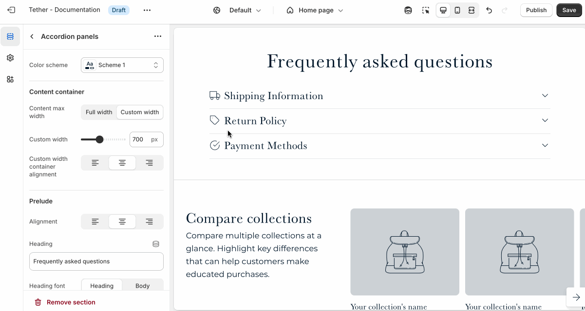
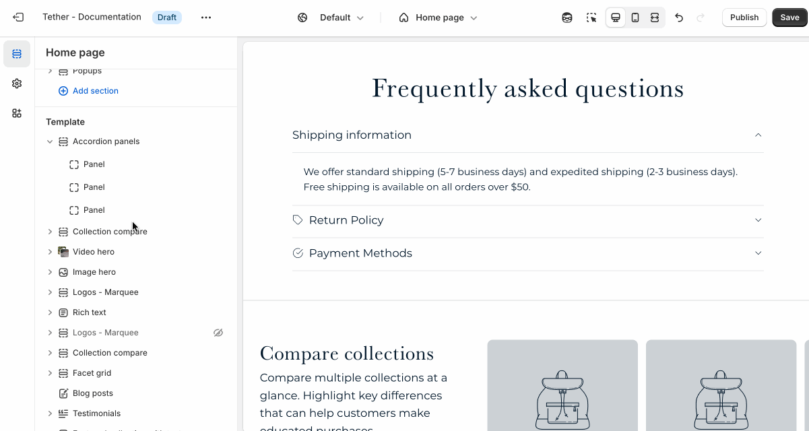

# Accordion panels

The Accordion Panels section is ideal for organizing content into collapsible panels.

:::tip Perfect for
* FAQs
* Product details
* Shipping info
* & more.

This format helps keep pages clean and easy to navigate, letting customers expand only the content they need.
:::

---

## Settings

| Setting               | Description                                                                 |
|------------------------|-----------------------------------------------------------------------------|
| **Color scheme**         | Select a predefined color scheme. |
| **Content container**         | [See shared settings > Content container](#content-container). Associated settings below.                        |
| **Prelude**         | [See shared settings > Prelude](#prelude). Associated settings below.                        |
| **Expand first panel**         | Show the first panel open when a user visits the store. |
| **Collapse other panels on open**         | Only allow 1 panel to be open at any given time. |
| **Panel style**         | Choose between Border between, Shaded, and Shaded every other to control the look and feel of the panels. |
| **Label font**         | Choose between your theme’s body or heading font. |
| **Label size**         | Adjust the label font size. |
| **Content text size**         | Adjust the content font size. |
| **Section spacing & border**     | [See shared settings > Section spacing & border](#spacing-and-border). Associated settings below.                    |
| **Section animations**     | Animate section when scrolled into view.                    |

---

import SharedSettings from '../_shared-settings/_shared-settings.md'

<SharedSettings />

import ContentContainer from '../_shared-settings/_content-container.mdx';

<ContentContainer />

import Prelude from '../_shared-settings/_prelude.mdx';

<Prelude />

import SpacingAndBorder from '../_shared-settings/_spacing-and-border.mdx';

<SpacingAndBorder />

import NestedBlocks from '../_shared-settings/_nested-blocks.md';

<NestedBlocks />

## Block - Panel

Each Panel block represents an individual accordion item with a heading and expandable content.

| Setting               | Description                                                                 |
|------------------------|-----------------------------------------------------------------------------|
| **Panel label**         | The title of your panel item. |
| **Icon**         | This dropdown lets you optionally choose from a curated set of icons that are designed to look great with your theme.                       |
| **Panel content**         | This is the content that appears when the panel is expanded.                        |
| **Desktop max content width**         | Control how wide the content appears on desktop screens. Use this to create a more focused layout or let content stretch wider across the page, depending on your design needs. |

