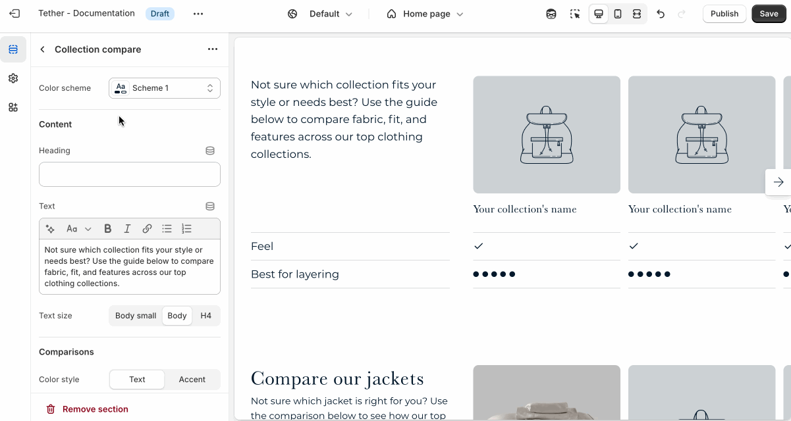

# Collection compare

The Collection compare section helps customers easily compare multiple collections side by side. It’s a great way to highlight differences between collections making it easier for customers to choose the right products for their needs.

## Settings

| Setting               | Description                                                                 |
|------------------------|-----------------------------------------------------------------------------|
| **Color scheme**         | Select a predefined color scheme. |
| **Heading** + **Associated settings**         | Customize the section heading. Choose between your theme’s body or heading font, adjust the font size, and optionally display the text in all caps for extra emphasis.                       |
| **Text** + **Associated settings**         | Customize the text, and size of your text to match your design. |
| **Comparison color style**         | Choose between showing your comparisons as your associated color scheme text color or give them a hint of color using your themes accent color.                        |
| **Comparison 1-5 title**| Add labels for the features or attributes you want to compare across products. |
| **Section spacing & border**     | [See shared settings > Section spacing & border](#spacing-and-border). Associated settings below.                    |
| **Section animations**     | Animate section when scrolled into view.                      |

import SharedSettings from '../_shared-settings/_shared-settings.md'

<SharedSettings />

import SpacingAndBorder from '../_shared-settings/_spacing-and-border.mdx';

<SpacingAndBorder />

## Block - Collection

Select your comparison collection and choose the comparison value associated with the numbered label.

| Setting               | Description                                                                 |
|------------------------|-----------------------------------------------------------------------------|
| **Collection**         | Select your comparison collection. |
| **Alternate collection image**         | Upload a custom image to display in this section instead of the collection’s default image. |
| **Alternate collection title**         | Use a custom title for this section instead of the default collection name. This lets you tailor the messaging to better fit the page or promotion, without changing the collection name across your store. |
| **Comparison 1-5 values**         | Choose between true, false, or 1-5 star type ratings to convey the differences between your collections. |

