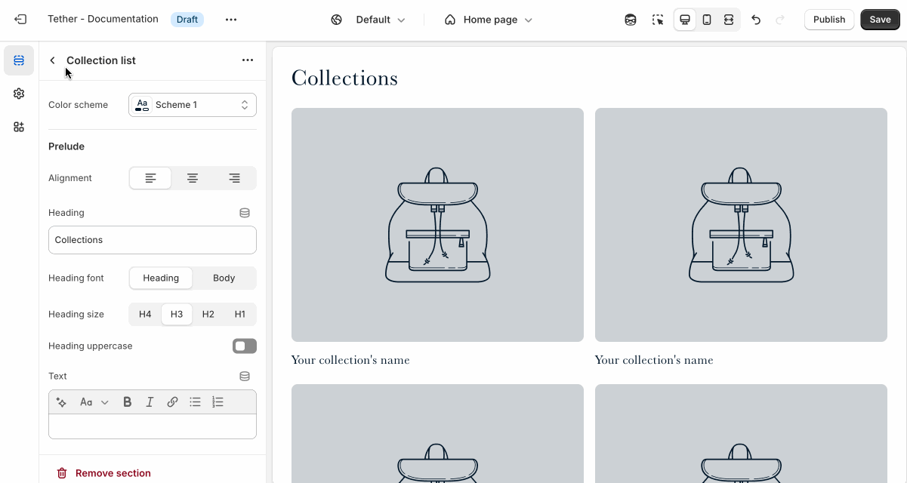
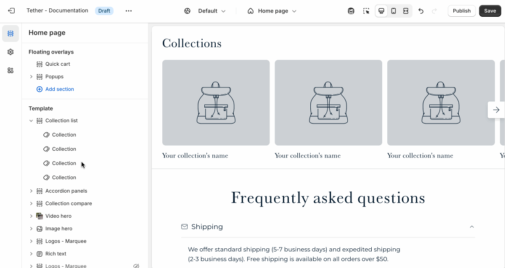

# Collection list

The Collection List section lets you showcase a group of collections in a grid or row layout.

---

## Settings

| Setting               | Description                                                                 |
|------------------------|-----------------------------------------------------------------------------|
| **Color scheme**         | Select a predefined color scheme. |
| **Prelude**         | [See shared settings > Prelude](#prelude). Associated settings below.                        |
| **Collection display mode**         | Choose to display your collections in a grid or slider. |
| **Number of columns on desktop**         | Pick how many collection items are visible in a row on desktop |
| **Number of columns on mobile**         | Pick how many collection items are visible in a row on mobile |
| **Section spacing & border**     | [See shared settings > Section spacing & border](#spacing-and-border). Associated settings below.                    |
| **Section animations**     | Animate section when scrolled into view.                    |

---

import SharedSettings from '../_shared-settings/_shared-settings.md'

<SharedSettings />

import Prelude from '../_shared-settings/_prelude.mdx';

<Prelude />

import SpacingAndBorder from '../_shared-settings/_spacing-and-border.mdx';

<SpacingAndBorder />

## Block - Collection

Select and customize your collection.

| Setting               | Description                                                                 |
|------------------------|-----------------------------------------------------------------------------|
| **Collection**         | Select your collection. |
| **Alternate collection image**         | Upload a custom image to display in this section instead of the collection’s default image. |
| **Alternate collection title**         | Use a custom title for this section instead of the default collection name. This lets you tailor the messaging to better fit the page or promotion, without changing the collection name across your store. |

