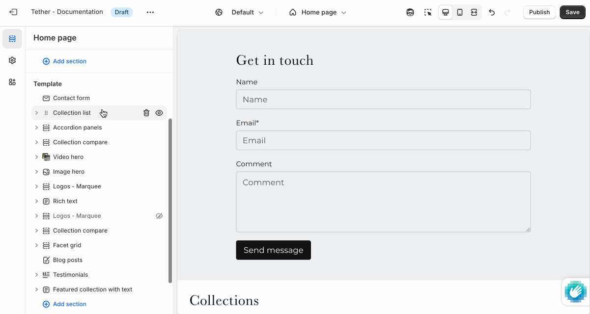

# Contact form

The Contact form section lets customers reach out directly from your store. It's perfect for handling questions, custom requests, or general inquiries.

---

## Settings

| Setting               | Description                                                                 |
|------------------------|-----------------------------------------------------------------------------|
| **Color scheme**         | Select a predefined color scheme. |
| **Content container**         | [See shared settings > Content container](#content-container). Associated settings below.                        |
| **Prelude**         | [See shared settings > Prelude](#prelude). Associated settings below.                        |
| **Name field layout**         | Choose how you want users to input their name and control how you want the fields to layout within the form. |
| **Include phone number field**         | Optionally show an input field to collect users phone numbers. |
| **Phone number field layout**         | Choose how you want the phone number input to layout within the form. |
| **Section spacing & border**     | [See shared settings > Section spacing & border](#spacing-and-border). Associated settings below.                    |
| **Section animations**     | Animate section when scrolled into view.                    |

---

import SharedSettings from '../_shared-settings/_shared-settings.md'

<SharedSettings />

import ContentContainer from '../_shared-settings/_content-container.mdx';

<ContentContainer />

import Prelude from '../_shared-settings/_prelude.mdx';

<Prelude />

import SpacingAndBorder from '../_shared-settings/_spacing-and-border.mdx';

<SpacingAndBorder />
