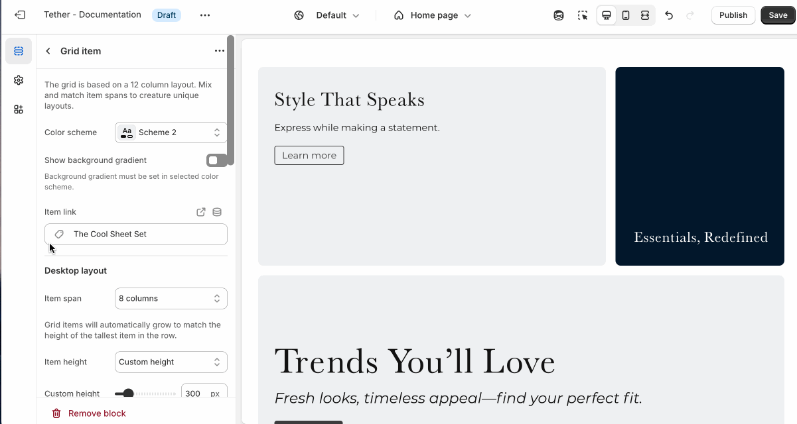

# Facet grid

The Facet grid section lets you create a flexible layout of images, videos, and text arranged in rows and columns. It’s ideal for building custom layouts, showcasing a mix of content types, or highlighting multiple features in a clean, structured format.

---

## Settings

| Setting               | Description                                                                 |
|------------------------|-----------------------------------------------------------------------------|
| **Color scheme**         | Select a predefined color scheme. |
| **Grid display width**         | Choose whether the grid stays within the theme's normal padding or extends beyond it for a more immersive layout. Extended allows the image to break out of the usual bounds, while within bounds keeps it aligned with the page content. |
| **Gap space**         | Choose between a standard uniform grid spacing or no spacing. |
| **Section spacing & border**     | [See shared settings > Section spacing & border](#spacing-and-border). Associated settings below.                    |
| **Section animations**     | Animate section when scrolled into view.                    |

---

import SharedSettings from '../_shared-settings/_shared-settings.md'

<SharedSettings />

import SpacingAndBorder from '../_shared-settings/_spacing-and-border.mdx';

<SpacingAndBorder />

## Block - Grid item

The grid is made up of 12 columns. Choose how you want to display your grid item using 'Item span' settings between desktop and mobile screens. Play around with different configurations to develop unique designs.

| Setting               | Description                                                                 |
|------------------------|-----------------------------------------------------------------------------|
| **Color scheme**         | Select a predefined color scheme. This scheme applies directly to the Grid item |
| **Grid display width**         | Show background gradient. Add a pop of color to really bring attention to your stores visitors. Note that the background is only visible if no media has been selected |
| **Item link**         | Link the entire grid item to a page in your store. |

### Desktop layout
| Setting               | Description                                                                 |
|------------------------|-----------------------------------------------------------------------------|
| **Item span**         | Control how many columns based on the 12 column grid the grid item spans on desktop screen sizes. The item span will have direct effects on a grid items neighbouring items. |
| **Item height**         | Choose between having the block items height be set using a custom height, or the media / content used in the Grid item. **Note:** The tallest grid item in a row will dictate the height of all items in that row.  |
| **Custom height**         | Set the custom height for your grid item. Only applies if Item height is set to 'Custom height'. Also only applies if this grid item is the tallest in a row. |                |

### Mobile layout
| Setting               | Description                                                                 |
|------------------------|-----------------------------------------------------------------------------|
| **Item span**         | Control how many columns based on the 12 column grid the grid item spans on mobile screen sizes. The item span will have direct effects on a grid items neighbouring items. |
| **Item height**         | Choose between having the block items height be set using a custom height, or the media / content used in the Grid item. **Note:** The tallest grid item in a row will dictate the height of all items in that row.  |
| **Custom height**         | Set the custom height for your grid item. Only applies if Item height is set to 'Custom height'. Also only applies if this grid item is the tallest in a row. |                |

### Media
| Setting               | Description                                                                 |
|------------------------|-----------------------------------------------------------------------------|
| **Media fit**         | Controls how the media fills its container. Use Cover to crop and fill the space, or Contain to show the entire media without cropping. |
| **Item height**         | Choose between having the block items height be set using a custom height, or the media / content used in the Grid item. **Note:** The tallest grid item in a row will dictate the height of all items in that row.  |
| **Media overlay opacity**| Adds a semi-transparent overlay on top of the media using the selected scheme background. Use this to improve text readability. |
| **Desktop image**        | Select the default image. |
| **Mobile image** `*`         | _Optional_. Upload a different image optimized for smaller screens. If left blank, the desktop image will be used on all devices. |
| **Video**        | Show a background video as an alternative to an image. |

import OverlayContent from '../_shared-settings/_overlay-content.mdx';

<OverlayContent />

import NestedBlocks from '../_shared-settings/_nested-blocks.md';

<NestedBlocks />
