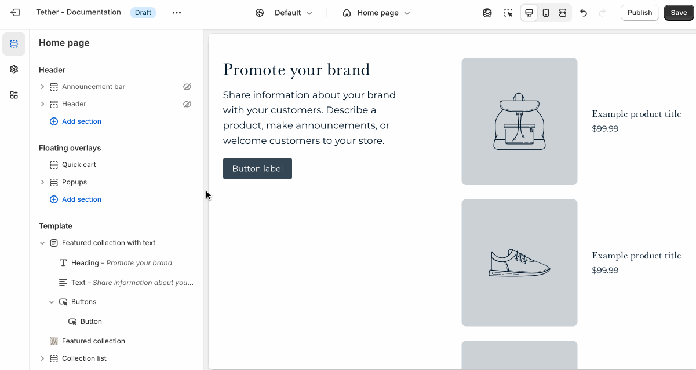

# Featured collection with text

The Featured collection with text section showcases products from a selected collection in a single-column layout, alongside nested block content. As customers scroll through the products, the text remains fixed, allowing your message to stay visible. It’s perfect for storytelling, sharing product details, or reinforcing a promotion while shoppers browse.

---

## Settings

| Setting               | Description                                                                 |
|------------------------|-----------------------------------------------------------------------------|
| **Color scheme**         | Select a predefined color scheme. |
| **Collection position**         | Choose to display the collection on the right or left of the text. Applies only on desktop screens.                        |
| **Sticky text on scroll**         | Enables the nested block content remaining focused while a user scrolls through the section. |
| **Text horizontal alignment**         | Nested blocks content horizontal alignment. |
| **Text vertical alignment**         | Where the nested block content is vertically aligned within the section. Note this will effect where the block content remains while scrolling if Sticky text on scroll is enabled. |
| **Collection**         | Select a collection to feature. Products will be pulled automatically based on the collection’s settings. |
| **Product list**         | Manually choose specific products to feature, instead of pulling them from a collection. |
| **Section spacing & border**     | [See shared settings > Section spacing & border](#spacing-and-border). Associated settings below.                    |
| **Section animations**     | Animate section when scrolled into view.                    |

---

import SharedSettings from '../_shared-settings/_shared-settings.md'

<SharedSettings />

import SpacingAndBorder from '../_shared-settings/_spacing-and-border.mdx';

<SpacingAndBorder />

import NestedBlocks from '../_shared-settings/_nested-blocks.md';

<NestedBlocks />