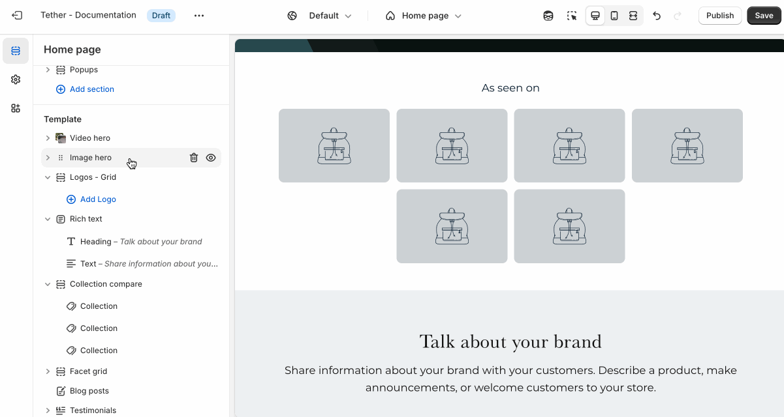
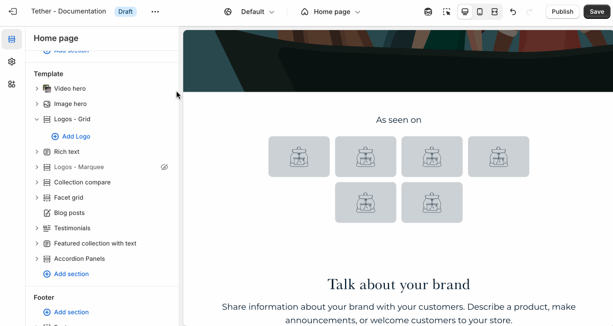

# Logos grid

The Logos grid section displays grid of sponsor or brand logos. It's designed to highlight partnerships, featured brands, or trusted affiliations in a way that's visually engaging and space-efficient.

---

## Settings

| Setting               | Description                                                                 |
|------------------------|-----------------------------------------------------------------------------|
| **Color scheme**         | Select a predefined color scheme. |
| **Content container**         | [See shared settings > Content container](#content-container). Associated settings below.                        |
| **Prelude**         | [See shared settings > Prelude](#prelude). Associated settings below.                        |
| **Number of columns on mobile**       | How many logos are visible in a row on mobile. Keeps logo size consistent between rows. |
| **Desktop max width**       | Set the desktop width of all logos in a single location. Ensures consistency across all logos at desktop screen sizes. |
| **Section spacing & border**     | [See shared settings > Section spacing & border](#spacing-and-border). Associated settings below.                    |
| **Section animations**     | Animate section when scrolled into view.                    |

---

import SharedSettings from '../_shared-settings/_shared-settings.md'

<SharedSettings />

import ContentContainer from '../_shared-settings/_content-container.mdx';

<ContentContainer />

import Prelude from '../_shared-settings/_prelude.mdx';

<Prelude />

import SpacingAndBorder from '../_shared-settings/_spacing-and-border.mdx';

<SpacingAndBorder />

## Block - Logo

Each Logo block contains a single logo image, with an optional link.

