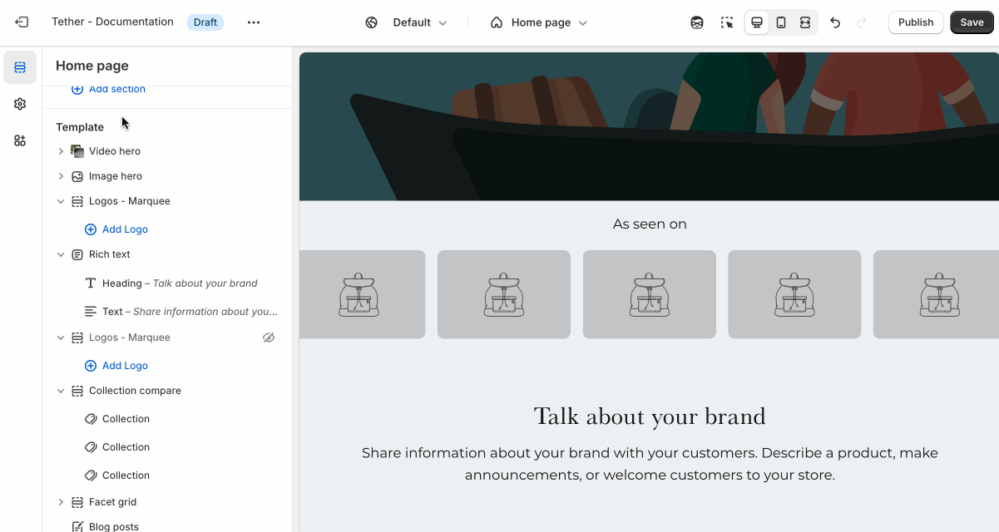
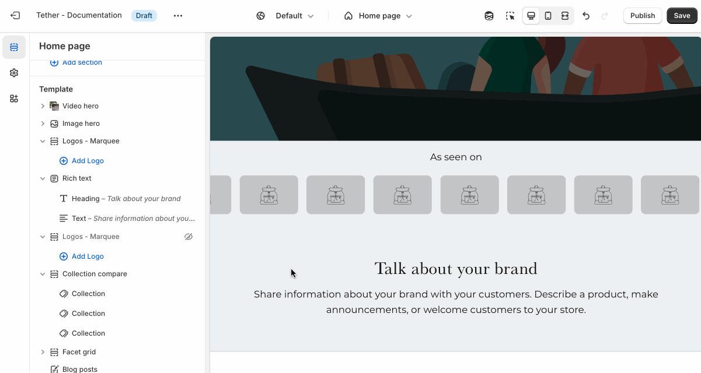

# Logos marquee

The Logos marquee section displays a scrolling row of sponsor or brand logos. It's designed to highlight partnerships, featured brands, or trusted affiliations in a way that's visually engaging and space-efficient.

---

## Settings

| Setting               | Description                                                                 |
|------------------------|-----------------------------------------------------------------------------|
| **Color scheme**         | Select a predefined color scheme. The background color is used for overlays. |
| **Prelude**         | [See shared settings > Prelude](#prelude). Associated settings below.                        |
| **Scroll speed**       |  Control the scroll speed. |
| **Scroll direction**       | Choose between left and right scroll direction. |
| **Logo max width**       | Set the width of all logos in a single location. Ensures consistency across all logos. |
| **Section spacing & border**     | [See shared settings > Section spacing & border](#spacing-and-border). Associated settings below.                    |
| **Section animations**     | Animate section when scrolled into view.                    |

:::note Scroll speed

The scroll speed is calculated using a fairly complex math equation that factors the amount of content within a marquee scroller and how much width the content takes.

You may need to adjust the scroll speed after altering your content.
:::

---

import SharedSettings from '../_shared-settings/_shared-settings.md'

<SharedSettings />

import Prelude from '../_shared-settings/_prelude.md';

<Prelude />

import SpacingAndBorder from '../_shared-settings/_spacing-and-border.md';

<SpacingAndBorder />

## Block - Logo

Each Logo block contains a single logo image, with an optional link.

