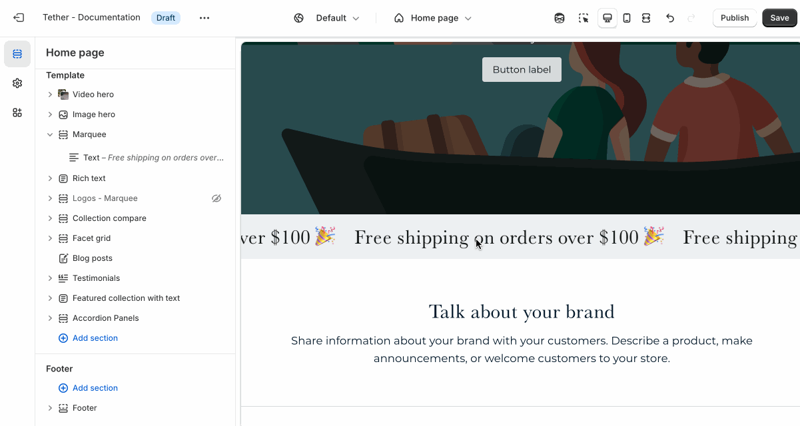
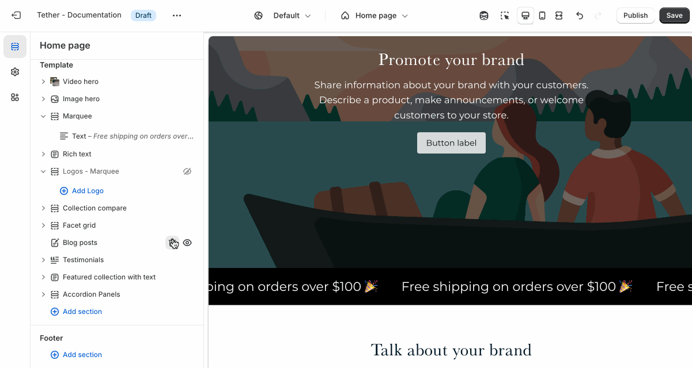
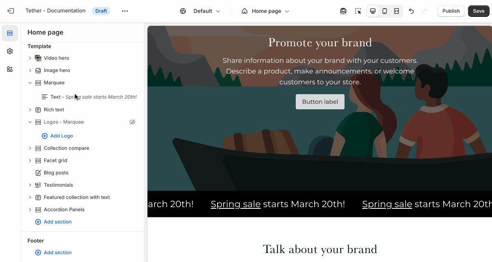

# Marquee

The Marquee section displays a continuous, horizontal scrolling row of content—such as text, images, or icon. It's a dynamic way to showcase product highlights, or promotional messages while adding motion and energy to the page.

---

## Settings

| Setting               | Description                                                                 |
|------------------------|-----------------------------------------------------------------------------|
| **Color scheme**         | Select a predefined color scheme. The background color is used for overlays. |
| **Space between content**         | The padding between each scroller content element.                        |
| **Banner font**| Choose between your theme’s body or heading font. |
| **Banner text size**        | Choose your font size. |
| **Scroll speed**       |  Control the scroll speed. |
| **Scroll direction**       | Choose between left and right scroll direction. |
| **Section spacing & border**     | [See shared settings > Section spacing & border](#spacing-and-border). Associated settings below.                    |
| **Section animations**     | Animate section when scrolled into view.                    |

:::note Scroll speed

The scroll speed is calculated using a fairly complex math equation that factors the amount of content within a marquee scroller and how much width the content takes.

You may need to adjust the scroll speed after altering your content.
:::

---

import SharedSettings from '../_shared-settings/_shared-settings.md'

<SharedSettings />

import SpacingAndBorder from '../_shared-settings/_spacing-and-border.mdx';

<SpacingAndBorder />

## Block - Text

Add text to the Marquee. Use Shopify's rich text editor to add emphasize and links.

## Block - Icon

Add an existing icon from the themes curated icon list, or use your own.

| Setting               | Description                                                                 |
|------------------------|-----------------------------------------------------------------------------|
| **Icon**         | This dropdown lets you choose from a curated set of icons that are designed to look great with your theme. |
| **Custom icon**         | Use your own custom icon / image.                        |
| **Custom icon width** | Control the size and file of your custom icon. |

