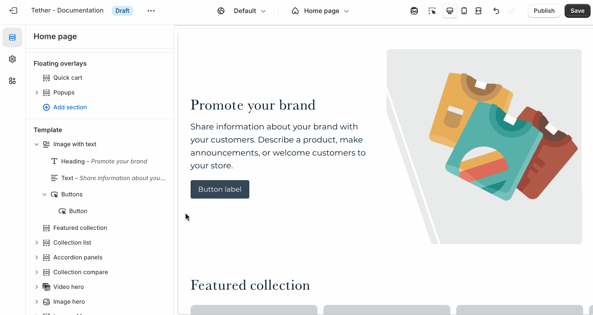

# Multi column

The Multi column section lets you display content side by side in two, three, or more columns—perfect for showcasing features, services, icons, or any content that benefits from a clean, structured layout.

## Settings

| Setting               | Description                                                                 |
|------------------------|-----------------------------------------------------------------------------|
| **Color scheme**         | Select a predefined color scheme. |
| **Prelude**         | [See shared settings > Prelude](#prelude). Associated settings below.
| **Content settings**         | [See all Content settings](#content-settings) |
| **Desktop layout settings**         | [See all Desktop layout settings](#desktop-layout-settings) |
| **Mobile layout settings**         | [See all Mobile layout settings](#mobile-layout-settings) |
| **Section spacing & border**     | [See shared settings > Section spacing & border](#spacing-and-border). Associated settings below.                    |
| **Section animations**     | Animate section when scrolled into view.                    |

---

## Content settings
Content settigns apply across all columns ensuring uniformity in your designs.

| Setting               | Description                                                                 |
|------------------------|-----------------------------------------------------------------------------|
| **Icon / image width**         | Set the icon / image width across all columns. Applies to desktop size screens. |
| **Mobile icon / image width**         | Set the mobile icon / image width across all columns. Applies to mobile size screens. |
| **Icon / image shape**         | Control the shape of your imagery, useful when not all content is the same. |
| **Show icon / image border**         | Display a border around your imagery. |
| **Border weight**         | The thickness of the optional border. |
| **Border padding**         | The spacing between your border and the inner icon / image. |

## Desktop layout settings
| Setting               | Description                                                                 |
|------------------------|-----------------------------------------------------------------------------|
| **Number of columns on desktop**         | How many columns your content spans on desktop screen sizes. |
| **Icon / image placement**         | Choose between showcasing your imagery above or next to your columns. |
| **Horizontal alignment**         | Choose how you want your content to align horizontally. |
| **Vertical alignment**         | Choose how you want your content align vertically in each row. |

:::tip
Smaller imagery and lower column counts work better for the 'Left of content' placement setting.
:::

## Mobile layout settings
| Setting               | Description                                                                 |
|------------------------|-----------------------------------------------------------------------------|
| **Layout**         | Choose to display your mobile content as a grid or within a slideshow |
| **Number of columns on desktop**         | How many columns your content spans on desktop screen sizes. Only applies if Layout is set to 'Columns' |
| **Icon / image placement**         | Choose between showcasing your imagery above or next to your columns. |
| **Horizontal alignment**         | Choose how you want your content to align horizontally. |
| **Vertical alignment**         | Choose how you want your content align vertically in each row. |

import SharedSettings from '../_shared-settings/_shared-settings.md'

<SharedSettings />

import Prelude from '../_shared-settings/_prelude.mdx';

<Prelude />

import SpacingAndBorder from '../_shared-settings/_spacing-and-border.mdx';

<SpacingAndBorder />

## Block - Column

| Setting               | Description                                                                 |
|------------------------|-----------------------------------------------------------------------------|
| **Icon**         | This dropdown lets you optionally choose from a curated set of icons that are designed to look great with your theme. |
| **Image**         | Optionally use a custom image / icon. `Icon must be set to 'None'` |
| **Heading** + **Associated settings**         | Customize the section heading. Choose between your theme’s body or heading font, adjust the font size, and optionally display the text in all caps for extra emphasis.                       |
| **Text** + **Associated settings**         | Customize the text, and size of your text to match your design. |

