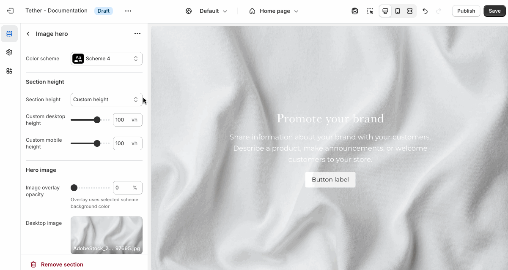
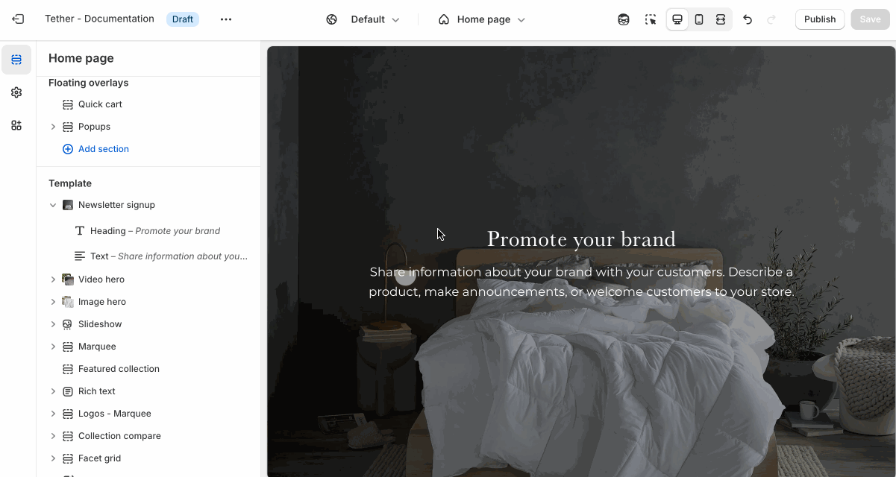

# Newsletter signup

The Newsletter Signup section encourages visitors to subscribe to your email list. It’s a simple, effective way to build a direct line of communication with your customers.

---

## Settings

| Setting               | Description                                                                 |
|------------------------|-----------------------------------------------------------------------------|
| **Color scheme**         | Select a predefined color scheme. The background color is used for overlays. |
| **Section height**         | [See shared settings > Section height](#section-height). Associated settings below.                        |
| **Image overlay opacity**| Adds a semi-transparent overlay on top of the image using the selected scheme background. Use this to improve text readability. |
| **Desktop image**        | Select the default image. |
| **Mobile image** `*`         | _Optional_. Upload a different image optimized for smaller screens. If left blank, the desktop image will be used on all devices. |
| **Section animations**     | Animate section when scrolled into view.                    |

---

import SharedSettings from '../_shared-settings/_shared-settings.md'

<SharedSettings />

import SectionHeight from '../_shared-settings/_section-height.mdx';

<SectionHeight heightLabel="Slide" />

import OverlayContent from '../_shared-settings/_overlay-content.md';

<OverlayContent />

## Newsletter block

The newsletter block is a custom block only available in the Newsletter signup section. It allows you to add a newsletter signup form as block content. Mix and match with regular Nested blocks to find a layout that works for your content.

import NestedBlocks from '../_shared-settings/_nested-blocks.md';

<NestedBlocks />