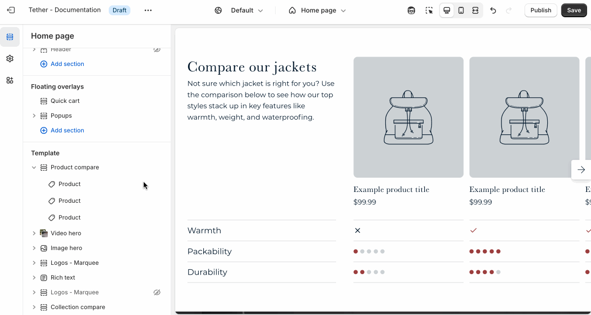

# Product compare

The Product compare section helps customers easily compare multiple products side by side. It’s a great way to highlight differences in quality, compatibility, or value, making it easier for customers to choose the right product for their needs.

## Settings

| Setting               | Description                                                                 |
|------------------------|-----------------------------------------------------------------------------|
| **Color scheme**         | Select a predefined color scheme. |
| **Heading** + **Associated settings**         | Customize the section heading. Choose between your theme’s body or heading font, adjust the font size, and optionally display the text in all caps for extra emphasis.                       |
| **Text** + **Associated settings**         | Customize the text, and size of your text to match your design. |
| **Comparison color style**         | Choose between showing your comparisons as your associated color scheme text color or give them a hint of color using your themes accent color.                        |
| **Comparison 1-5 title**| Add labels for the features or attributes you want to compare across products. |
| **Section spacing & border**     | [See shared settings > Section spacing & border](#spacing-and-border). Associated settings below.                    |
| **Section animations**     | Animate section when scrolled into view.                      |

import SharedSettings from '../_shared-settings/_shared-settings.md'

<SharedSettings />

import SpacingAndBorder from '../_shared-settings/_spacing-and-border.mdx';

<SpacingAndBorder />

## Block - Product

Select your comparison product and choose the comparison value associated with the numbered label.

| Setting               | Description                                                                 |
|------------------------|-----------------------------------------------------------------------------|
| **Product**         | Select your comparison product. |
| **Comparison 1-5 values**         | Choose between true, false, or 1-5 star type ratings to convey the differences between your products. |

