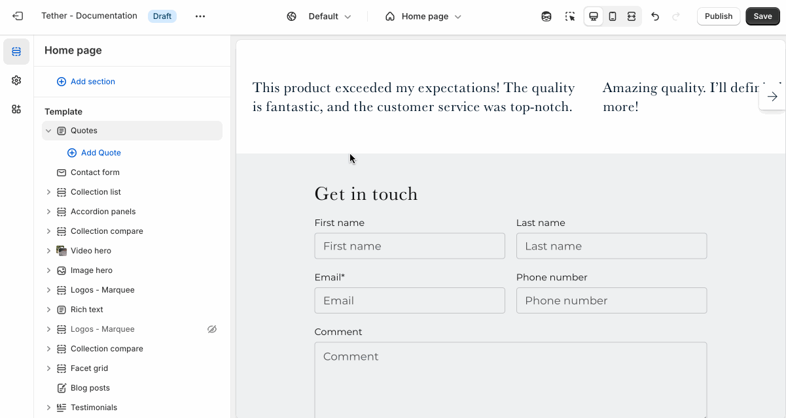
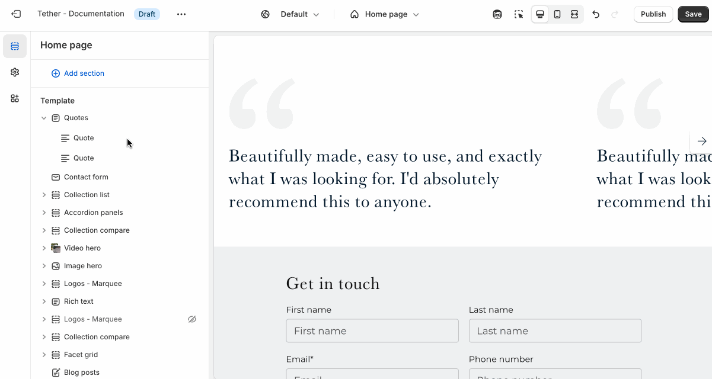

# Quotes

The Quotes section displays large quotes to highlight testimonials, brand messages, or inspirational text. It’s a bold, expressive way to add personality and trust to your store’s pages.

---

## Settings

| Setting               | Description                                                                 |
|------------------------|-----------------------------------------------------------------------------|
| **Color scheme**         | Select a predefined color scheme. |
| **Prelude**         | [See shared settings > Prelude](#prelude). Associated settings below.                        |
| **Quote font**         | Choose between your theme’s body or heading font. |
| **Quote size**         | Adjust the quotes font size. |
| **Show decorative quote mark**         | Optionally show a decorative quote mark. |
| **Quote mark style**         | Choose a style for your decorative quote mark. |
| **Quote mark size**         | Adjust the size of the decorative quote mark. |
| **Quote mark color**         | Choose between showing your decorative quote mark as your associated color scheme text color or give them a hint of color using your themes accent color. |
| **Quote mark opacity**         | Control how faint or bold your decorative quote mark appears. |
| **Section spacing & border**     | [See shared settings > Section spacing & border](#spacing-and-border). Associated settings below.                    |
| **Section animations**     | Animate section when scrolled into view.                    |

---

import SharedSettings from '../_shared-settings/_shared-settings.md'

<SharedSettings />

import Prelude from '../_shared-settings/_prelude.mdx';

<Prelude />

import SpacingAndBorder from '../_shared-settings/_spacing-and-border.mdx';

<SpacingAndBorder />

## Block - Quote

Display a featured quote, testimonial, or message. Enter the main quote in the text field, and optionally include an author name to show beneath it.

