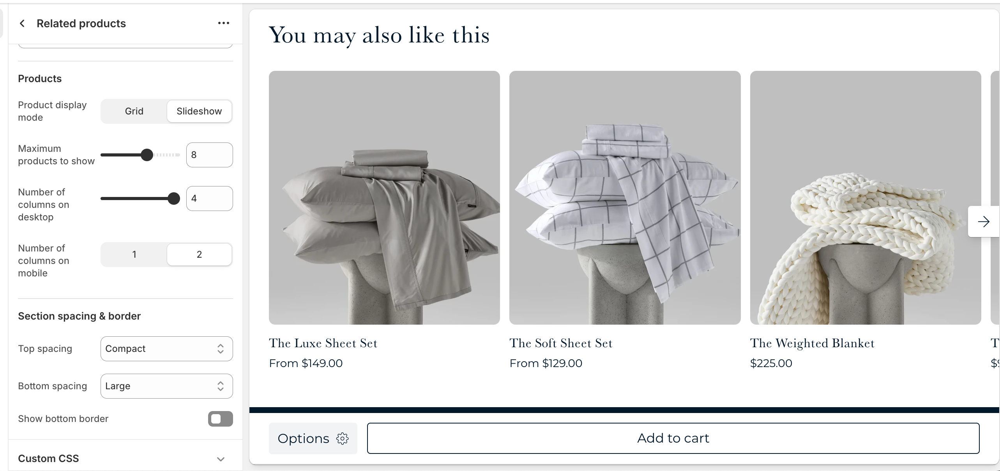

# Related products

The Related Products section helps customers discover more items they may be interested in by displaying products related to the one they’re currently viewing. This section can increase engagement and average order value by suggesting complementary or similar products.

By default, related products are automatically generated based on Shopify’s internal logic. For more control, you can use the Shopify [Search & Discovery](https://apps.shopify.com/search-and-discovery) app to manually customize product recommendations and fine-tune what appears based on the displayed product.

:::note
This section is only available on the Product page.
:::

---

## Settings

| Setting               | Description                                                                 |
|------------------------|-----------------------------------------------------------------------------|
| **Color scheme**         | Select a predefined color scheme. |
| **Prelude**         | [See shared settings > Prelude](#prelude). Associated settings below.                        |
| **Product display mode**         | Choose to display your related products in a grid or slider. |
| **Maximum products to show**         | How many related products you want to show. |
| **Number of columns on desktop**         | Pick how many related products are visible in a row on desktop. |
| **Number of columns on mobile**         | Pick how many related products are visible in a row on mobile. |
| **Section spacing & border**     | [See shared settings > Section spacing & border](#spacing-and-border). Associated settings below.                    |
| **Section animations**     | Animate section when scrolled into view.                    |

---

import SharedSettings from '../_shared-settings/_shared-settings.md'

<SharedSettings />

import Prelude from '../_shared-settings/_prelude.mdx';

<Prelude />

import SpacingAndBorder from '../_shared-settings/_spacing-and-border.mdx';

<SpacingAndBorder />
