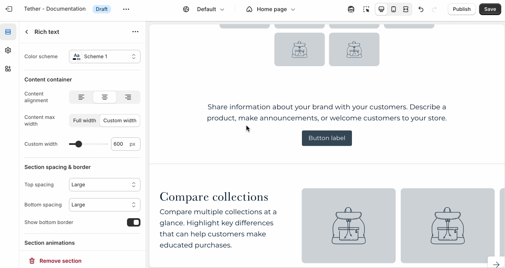

# Rich text

The Rich text section allows you to add flexible text-based content to your page. This section is ideal for adding custom messaging, introducing collections or products, or sharing store information. It’s a versatile block for storytelling or structured content that doesn’t require media.

:::tip Usage
Use the Rich text section to:
* Highlight a sale, collection, or featured product with a heading and short message
* Share your brand story, values, or a personal note with customers
* Add helpful info like store hours, shipping details, or return policies
* Include a button that links to a product, collection, or any page in your store
:::

---

## Settings

| Setting               | Description                                                                 |
|------------------------|-----------------------------------------------------------------------------|
| **Color scheme**         | Select a predefined color scheme. The background color is used for overlays. |
| **Content container**         | [See shared settings > Content container](#content-container). Associated settings below.                        |
| **Content alignment**         | Control the horizontal aligment of all Rich text content.                 |
| **Section spacing & border**     | [See shared settings > Section spacing & border](#spacing-and-border). Associated settings below.                    |
| **Section animations**     | Animate section when scrolled into view.                    |

---

import SharedSettings from '../_shared-settings/_shared-settings.md'

<SharedSettings />

import ContentContainer from '../_shared-settings/_content-container.mdx';

<ContentContainer />

import SpacingAndBorder from '../_shared-settings/_spacing-and-border.mdx';

<SpacingAndBorder />

import NestedBlocks from '../_shared-settings/_nested-blocks.md';

<NestedBlocks />