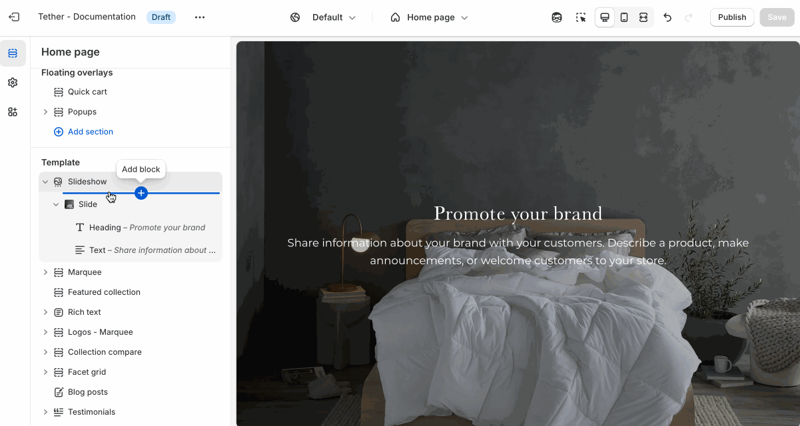

# Slideshow

The Slideshow section allows you to display multiple slides that transition either automatically or manually. This is a great way to highlight promotions, feature products, or tell a visual story.

---

## Settings

| Setting               | Description                                                                 |
|------------------------|-----------------------------------------------------------------------------|
| **Automatically advance slides**   | Enables autoplay. When turned on, slides will automatically advance after a set time.         |
| **Advance every**           | Defines how many seconds to wait before advancing to the next slide. Only active if autoplay is enabled.                                       |
| **Transition style**     | Choose how slides transition: Slide (slides move horizontally) or Fade (crossfade effect).       |
| **Section height**         | [See shared settings > Section height](#section-height). Associated settings below.                        |
| **Animate on slide**     | When enabled, triggers content animations as each slide appears.                    |

---

## Slide block

Each slide in the Slideshow section includes its own content and styling options. These settings control the appearance and layout of the individual slide.

| Setting                  | Description |
|--------------------------|-------------|
| **Color scheme**         | Select a predefined color scheme. The background color is used for overlays. |
| **Image overlay opacity**| Adds a semi-transparent overlay on top of the image using the selected scheme background. Use this to improve text readability. |
| **Desktop image**        | Select the default image. |
| **Mobile image** `*`         | _Optional_. Upload a different image optimized for smaller screens. If left blank, the desktop image will be used on all devices. |
| **Slide content**         | [See shared block settings > Overlay content](#overlay-content). Associated settings below. |

---

import SharedSettings from '../_shared-settings/_shared-settings.md'

<SharedSettings />

import SectionHeight from '../_shared-settings/_section-height.mdx';

<SectionHeight heightLabel="Slide" />

:::info Avoid layout shifts
If Section height is set to Slide height, you can avoid layout shifts by using slide images that use the same aspect ratio.
:::

import OverlayContent from '../_shared-settings/_overlay-content.md';

<OverlayContent />

import NestedBlocks from '../_shared-settings/_nested-blocks.md';

<NestedBlocks />