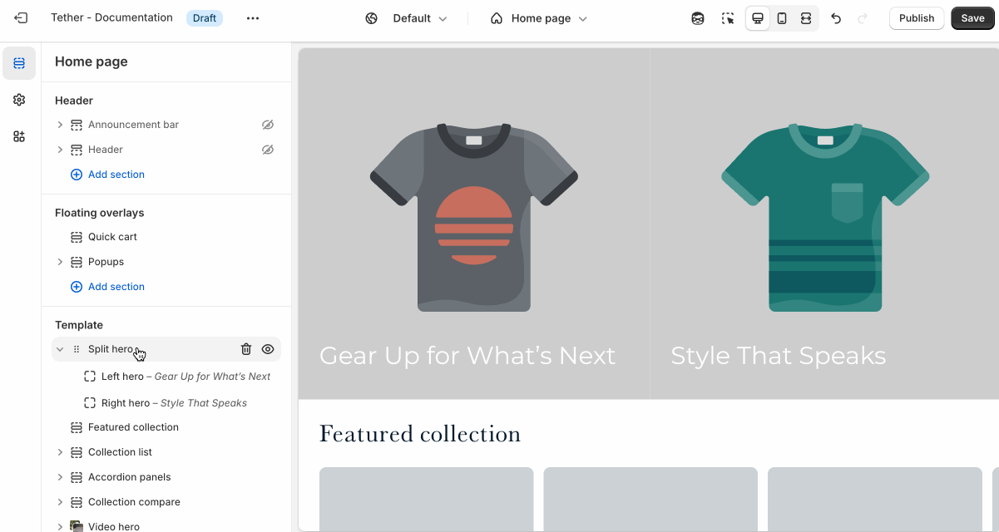

# Split hero

The Split hero section displays two images side by side with text content within them. It’s a bold, modern layout ideal for showcasing dual product lines, contrasting visuals, or creating visual symmetry while delivering a central message.

---

## Settings

Each hero side controls specific settings. Only over overarching settings are set at the section level.

| Setting               | Description                                                                 |
|------------------------|-----------------------------------------------------------------------------|
| **Aspect ratio**         | Control the aspect ratio of images on both sides of the hero. |
| **Mobile aspect ratio**         | Control the aspect ratio of the images when they break to a stacked layout on mobile sizes screens. |
| **Section animations**     | Animate section when scrolled into view.                    |

---

## Block - Left / Right hero

Settings are identical for the left and right hero.

| Setting               | Description                                                                 |
|------------------------|-----------------------------------------------------------------------------|
| **Color scheme**         | Select a predefined color scheme. The background color is used for overlays. |
| **Desktop image**        | Select the default image. |
| **Mobile image** `*`         | _Optional_. Upload a different image optimized for smaller screens. If left blank, the desktop image will be used on all devices. |
| **Image overlay opacity**| Adds a semi-transparent overlay on top of the image using the selected scheme background. Use this to improve text readability. |
| **Heading** + **Associated settings**         | Customize the hero heading. Choose between your theme’s body or heading font, adjust the font size, and optionally display the text in all caps for extra emphasis.                       |
| **Link**         | Wrap the entire hero in a link. Choose to display a button by setting the button text. |
| **Button** + **Associated settings**  | Customize the button label, add a button link, adjust the button size, and pick the button style.    |

