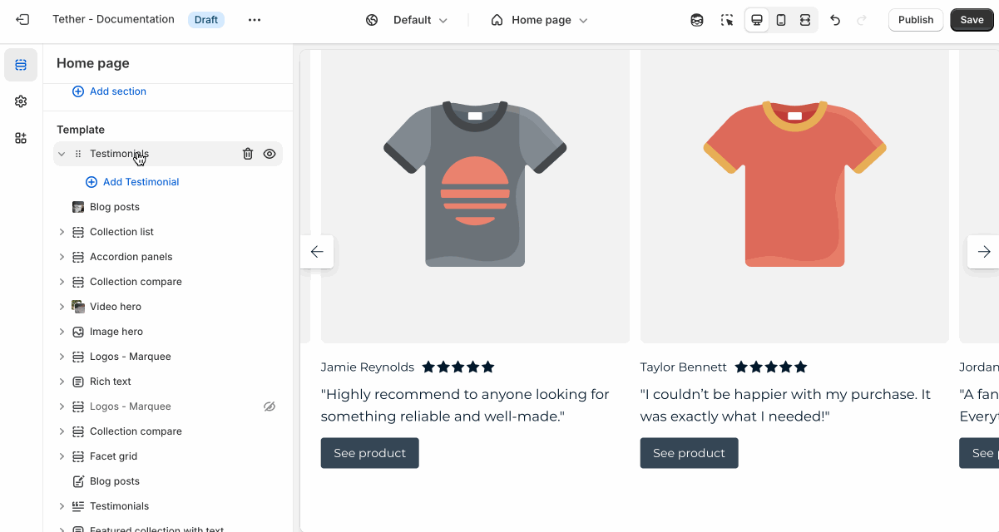

# Testimonials

The Testimonials section lets you showcase customer feedback, reviews, or endorsements to build trust and credibility.

---

## Settings

| Setting               | Description                                                                 |
|------------------------|-----------------------------------------------------------------------------|
| **Color scheme**         | Select a predefined color scheme. |
| **Prelude**         | [See shared settings > Prelude](#prelude). Associated settings below.                        |
| **Product image aspect ratio**         | Control the aspect ratio of the testimonial image. |
| **Star color**         | Chose to use the color scheme text color, your accent color, or a custom color for testimonial rating stars. |
| **Custom star color**         | Set the custom star color, only applies if Star color is set to custom. |
| **Shop button text**         | Apply the same label to all Shop buttons that appear below the testimonial item. |
| **Shop button size**         | Control the size of the Shop button |
| **Shop button style**         | Control the style of the Shop button |
| **Section spacing & border**     | [See shared settings > Section spacing & border](#spacing-and-border). Associated settings below.                    |
| **Section animations**     | Animate section when scrolled into view.                    |

---

import SharedSettings from '../_shared-settings/_shared-settings.md'

<SharedSettings />

import Prelude from '../_shared-settings/_prelude.mdx';

<Prelude />

import SpacingAndBorder from '../_shared-settings/_spacing-and-border.mdx';

<SpacingAndBorder />

## Block - Testimonial

Create individual testimonials with a quote, customer name, and optional product association. Showing product testimonials highlight real customer experiences and adds social proof to specific items in your store.

| Setting               | Description                                                                 |
|------------------------|-----------------------------------------------------------------------------|
| **Product**         | Optionally select a product to use as a focus for your testimonial. |
| **Product image**         | Add a custom image for the assocated product. Great for showing the product in use by the author of the testimonial. |
| **Author image**         | Add a face to bring personality to your testimonial. |
| **Author name**         | Set the name of the author. |
| **Show rating**         | Optionally show the star rating given to the associated product. |
| **Star rating**         | Set the rating for the testimonial. |
| **Author title**         | Set the author title. |
| **Quote**         | Testimonial text content. |

