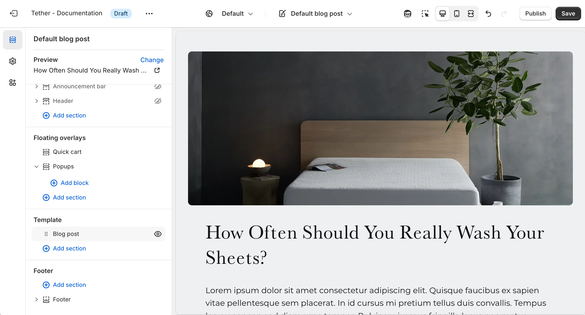

# Blog posts template

The Blog posts template controls the layout and content of individual blog articles. It displays the post title, featured image, published date, and article content, along with any additional sections you’ve added—like related posts, a signup form, or promotional banners. Use this template to create a consistent, branded reading experience for your store’s blog.

## Blog post section

| Setting               | Description                                                                 |
|------------------------|-----------------------------------------------------------------------------|
| **Color scheme**         | Select a predefined color scheme. |
| **Image display width**         | Choose whether the featured image stays within the theme's normal padding or extends beyond it for a more immersive layout. Extended allows the image to break out of the usual bounds, while within bounds keeps it aligned with the page content.                     |
| **Article image aspect ratio**         | Control the aspect ratio of the featured image.                  |
| **Show article details in hero on desktop**         | Display the featured image as a hero overlaying the title and other post information on desktop screen sizes.                  |
| **Details in hero style**         | Choose to use a gradient that blends or contrasts the image to improve readability. Only applies if showing as hero.                  |
| **Show article tags**         | Show button links displaying article tags. The tags can be used to categorize blogs keeping like content together and helping users find further related content.                  |
| **Show article publish date**         | Show when the article was published.                  |
| **Show article authors name**         | Show when the article author.                  |
| **Show share button**         | Show a button at the end of the article that will allow users to easily share the article with a friend or on social media.                  |
| **Section spacing & border**     | [See shared settings > Section spacing & border](#spacing-and-border). Associated settings below.                    |
| **Section animations**     | Animate section when scrolled into view.

---

import SharedSettings from '../_shared-settings/_shared-settings.md'

<SharedSettings />

import SpacingAndBorder from '../_shared-settings/_spacing-and-border.mdx';

<SpacingAndBorder />