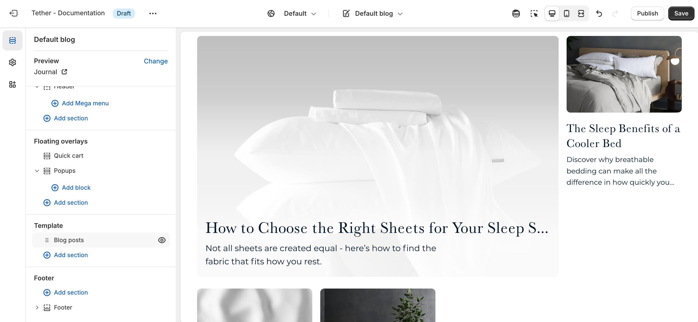

# Blogs template

The Blogs template controls the layout of a blog’s main page, where all of its articles are listed. This template helps customers browse your blog content and find posts that interest them, whether it's news, guides, or brand updates.

## Blog posts section

| Setting               | Description                                                                 |
|------------------------|-----------------------------------------------------------------------------|
| **Color scheme**         | Select a predefined color scheme. |
| **Articles per row on desktop**         | Pick how many blog posts are visible in a row on desktop.                     |
| **Highlight first article of each page**         | Show the first article on each blog page as highlighted. Highlighted blogs are enlarged and use a larger width to breakup the layout and engage readers.                  |
| **Highlight style**         | Choose between showing your highlighted article on a blending or contrasting background                  |
| **Article image aspect ratio**         | Control the aspect ratio of the blog posts featured image. |
| **Show article tags**         | Show button links displaying article tags. The tags can be used to categorize blogs keeping like content together and helping users find further related content.                  |
| **Show article publish date**         | Show when the article was published.                  |
| **Show article authors name**         | Show when the article author.                  |
| **Show article excerpt**         |  Show a short excerpt from the article.                  |
| **Section spacing & border**     | [See shared settings > Section spacing & border](#spacing-and-border). Associated settings below.                    |
| **Section animations**     | Animate section when scrolled into view.

---

import SharedSettings from '../_shared-settings/_shared-settings.md'

<SharedSettings />

import SpacingAndBorder from '../_shared-settings/_spacing-and-border.mdx';

<SpacingAndBorder />