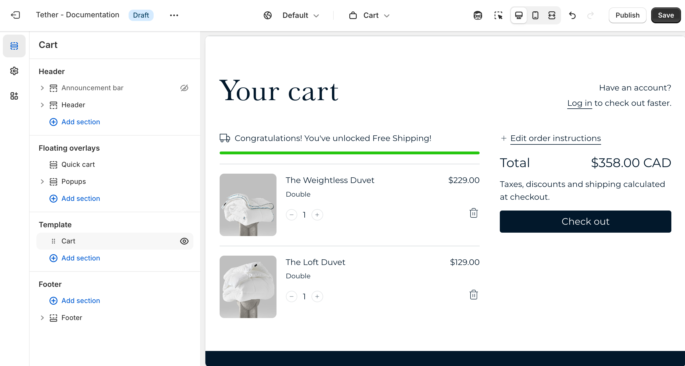
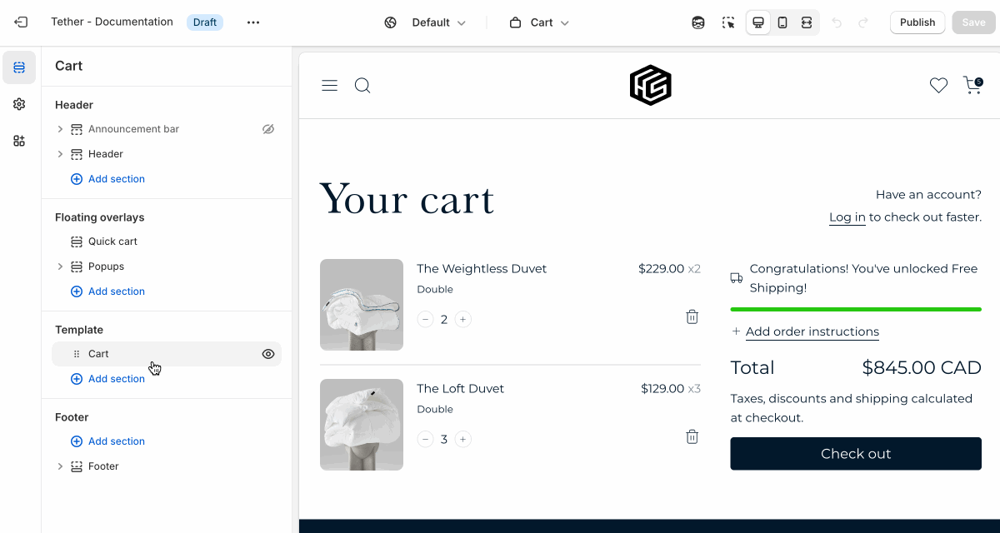

# Cart template

The Cart template controls the layout and content of the cart page. It displays the products a customer has added to their cart, along with quantities, prices, and a checkout button.

:::info
The Cart template is only accessible by updating the page url to `/cart` unless the quick cart is disabled.

If the Quick cart is disabled a user can access the cart template via the cart button in the header.
:::

## Cart section

| Setting               | Description                                                                 |
|------------------------|-----------------------------------------------------------------------------|
| **Color scheme**         | Select a predefined color scheme. |
| **Free shipping bar position**         | Choose where the free shipping message appears in the cart—either above the list of cart items or above the cart total. This helps you place the message where it’s most visible and impactful for your customers. |
| **Section spacing & border**     | [See shared settings > Section spacing & border](#spacing-and-border). Associated settings below.                    |
| **Section animations**     | Animate section when scrolled into view.

---

import SharedSettings from '../_shared-settings/_shared-settings.md'

<SharedSettings />

import SpacingAndBorder from '../_shared-settings/_spacing-and-border.mdx';

<SpacingAndBorder />