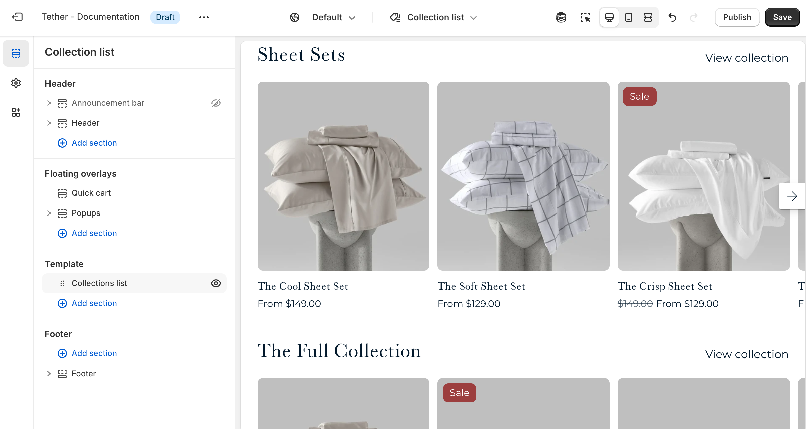

# Collection list template

The Collection list template displays all collections in your store in a single location. This template is great for organizing your store and helping shoppers easily explore different product groups.

:::tip Have a lot of collections?
The Collection list section allows you to use a curated list of collections rather than showing every collection in your store.
:::

## Collection list section

| Setting               | Description                                                                 |
|------------------------|-----------------------------------------------------------------------------|
| **Color scheme**         | Select a predefined color scheme. |
| **Title alignment**         | Control the page title alignment.                        |
| **Sort collections by:**         | Choose what order your collection appear in. |
| **Collections**`optional`         | Manually choose specific collections to show, instead of pulling all collections from your store. |
| **Product display mode**         | Choose to display your collections in a grid or slider. |
| **Maximum products to show**         | How many products you want to showcase from your collection. |
| **Number of columns on desktop**         | Pick how many collection items are visible in a row on desktop. |
| **Number of columns on mobile**         | Pick how many collection items are visible in a row on mobile. |
| **Section spacing & border**     | [See shared settings > Section spacing & border](#spacing-and-border). Associated settings below.                    |
| **Section animations**     | Animate section when scrolled into view.                    |

---

import SharedSettings from '../_shared-settings/_shared-settings.md'

<SharedSettings />

import SpacingAndBorder from '../_shared-settings/_spacing-and-border.mdx';

<SpacingAndBorder />