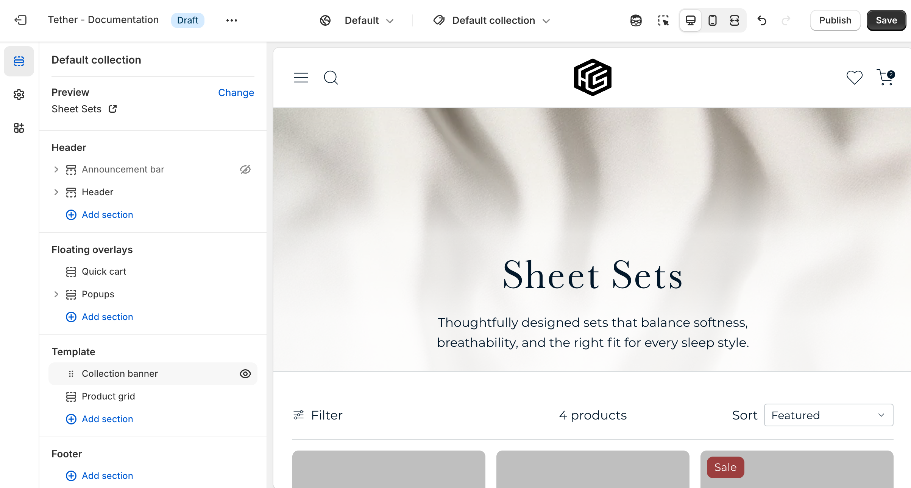
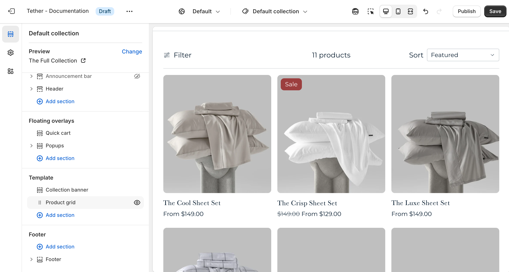
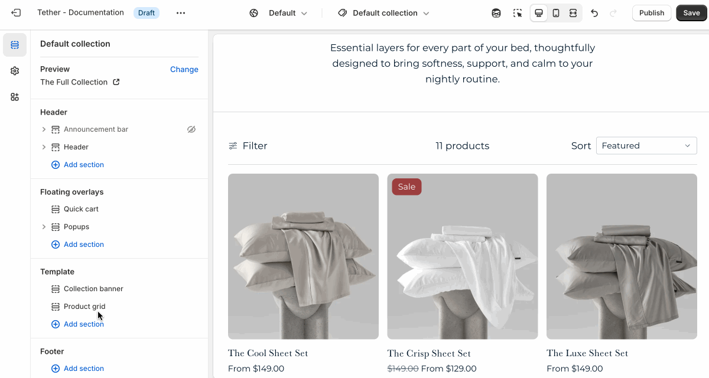

# Collections template

The Collection template controls the layout of individual collection pages. It displays the collection’s title, image, and description, followed by a grid of products within that collection.

## Collection banner section

| Setting               | Description                                                                 |
|------------------------|-----------------------------------------------------------------------------|
| **Color scheme**         | Select a predefined color scheme. |
| **Show collection description**         | Choose whether to display the collection’s description. |
| **Show collection image**         | Choose whether to display the collection’s featured image. |
| **Image layout**         | Show the collection image as either a hero with overlaid text, or a separate side by side layout. |
| **Details in hero style**         |  Choose to use a gradient that blends or contrasts the image to improve readability. Only applies if showing as hero. |
| **Image display width**         |  Choose whether the image stays within the theme's normal padding or extends beyond it for a more immersive layout. Extended allows the image to break out of the usual bounds, while within bounds keeps it aligned with the page content. |
| **Image aspect ratio**         |  Control the aspect ratio of the collection image. |
| **Section spacing & border**     | [See shared settings > Section spacing & border](#spacing-and-border). Associated settings below.                    |
| **Section animations**     | Animate section when scrolled into view.                    |

---

## Product grid section

| Setting               | Description                                                                 |
|------------------------|-----------------------------------------------------------------------------|
| **Color scheme**         | Select a predefined color scheme. |
| **Content**         | [See all Content settings](#content-settings) |
| **Product**         | [See all Product settings](#product-settings) |
| **Filtering and sorting**         | [See all Filtering and sorting settings](#filtering-and-sorting-settings) |
| **Section spacing & border**     | [See shared settings > Section spacing & border](#spacing-and-border). Associated settings below.                    |
| **Section animations**     | Animate section when scrolled into view.                    |

---

### Content settings

| Setting               | Description                                                                 |
|------------------------|-----------------------------------------------------------------------------|
| **Show product count**         | Display the number of products visible in the collection. Updates when filters are applied. |
| **Products per page**         | How many products are visible on each paginated page. |
| **Pagination style**         | Choose how customers navigate through products beyond the current page in the collection.  |

:::tip Pagination style
This setting helps you control how content loads, based on the experience you want to create.

* **Paginated**: Shows numbered pages for manual navigation.
* **Click to load more**: Loads more products when a button is clicked.
* **Load on scroll**: Automatically loads more products as the customer scrolls (infinite scroll).
:::

### Product settings

| Setting               | Description                                                                 |
|------------------------|-----------------------------------------------------------------------------|
| **Products per row on desktop**         | Pick how many products are visible in a row on desktop |
| **Products per row on mobile**         | Pick how many products are visible in a row on mobile |

### Filtering and sorting settings

| Setting               | Description                                                                 |
|------------------------|-----------------------------------------------------------------------------|
| **Show result filtering**         | Allow users to filter and refine the products shown in the collection through the filter panel. |
| **Show result sorting**         | Allow users to update the order of products shown in the collection. |
| **Group active filters by type**         | When filters are applied and the filter panel is closed, active filters appear as dismissable filter buttons. Enabling grouping will organize these buttons by filter type. Making it easier for customers to see what categories or options they’ve selected. |

import SharedSettings from '../_shared-settings/_shared-settings.md'

<SharedSettings />

import SpacingAndBorder from '../_shared-settings/_spacing-and-border.mdx';

<SpacingAndBorder />