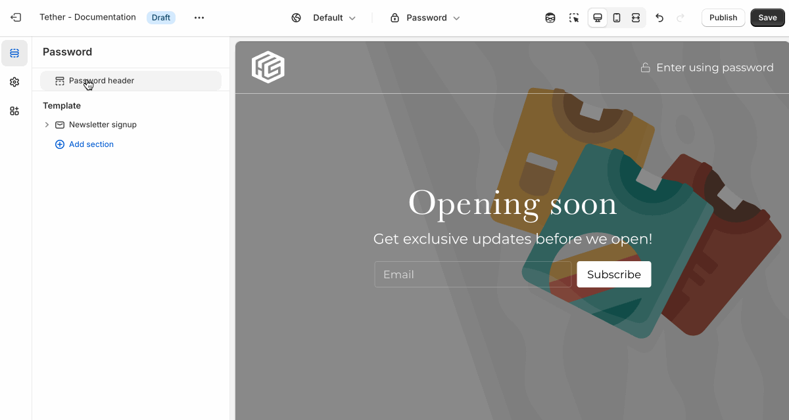

# Password template

The Password template is shown when your store is password protected. It allows you to display a branded landing page with a message, logo, and password field while your store is under construction or in pre-launch mode. Customers can enter the password to access your storefront.

## Password header section

| Setting               | Description                                                                 |
|------------------------|-----------------------------------------------------------------------------|
| **Show as transparent header**         | Display the header as transparent.  |
| **Show border** + **Associated settings**         | Optionally show a bottom border, control the width, color, and opacity of the bottom border.  |
| **Logo alignment**         | Display your logo on the left or center of the header. |

:::tip
Transparent headers look the best on top of full width sections like:
* Image hero
* Newsletter signup
* Slideshow
* Split hero
* Video hero
:::