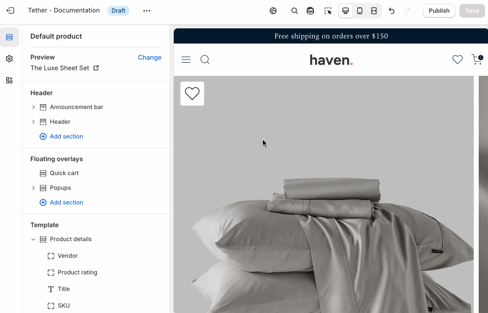
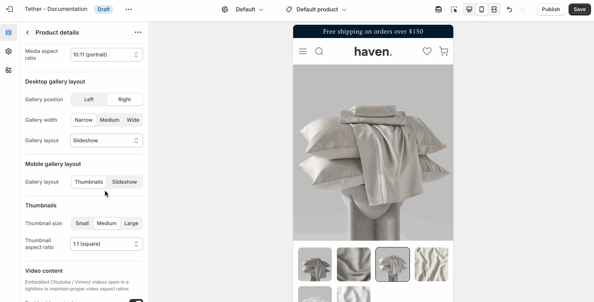
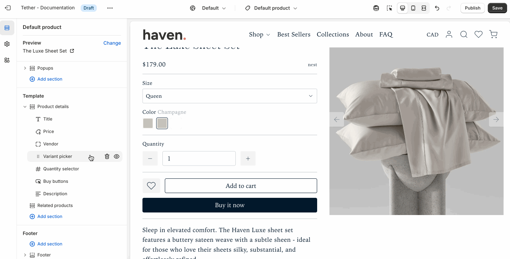
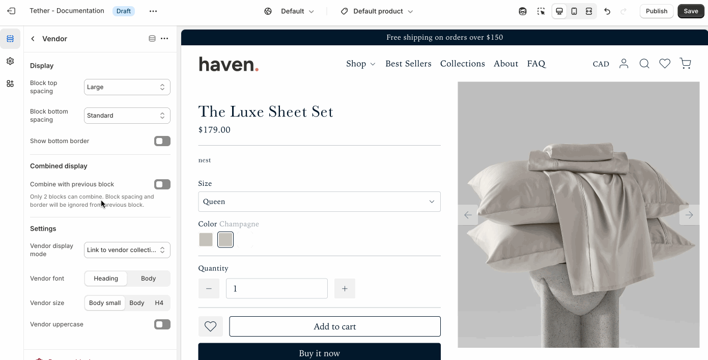

# Product template

The product template is designed to help customers make informed purchase decisions while staying aligned with your brand’s style and layout.

## Product details section

The Product details section controls the layout and content of your product pages. It displays essential details like product images, title, price, variants, and descriptions.

### Settings
| Setting               | Description                                                                 |
|------------------------|-----------------------------------------------------------------------------|
| **Color scheme**         | Select a predefined color scheme. |
| **Show moible sticky purchase bar**         | Show a sticky purchase bar after users have scrolled beyond the 'Add to cart' button on non-desktop sized screens. |

### Media settings
Control product media contents bounds and aspect ratio.

| Setting               | Description                                                                 |
|------------------------|-----------------------------------------------------------------------------|
| **Media display width**         | Choose whether the product media stays within the theme's normal padding or extends beyond it for a more immersive layout. Extended allows the image to break out of the usual bounds, while within bounds keeps it aligned with the page content. |
| **Aspect ratio**         | Control the aspect ratio of the product media. |

### Desktop gallery layout
Choose how product images are displayed on desktop screens. Choose how to highlights your product and complements your overall store design.

| Setting               | Description                                                                 |
|------------------------|-----------------------------------------------------------------------------|
| **Gallery position**         | Choose between showing the media gallery on the left or right of the product content. |
| **Gallery width**         | Control the general width of the media gallery. |
| **Gallery layout**         | Choose between displaying your gallery as a slideshow, stacked columns, or as a featured image with thumbnails. |

### Mobile gallery layout
Choose how product images are displayed on non-desktop screens.

| Setting               | Description                                                                 |
|------------------------|-----------------------------------------------------------------------------|
| **Gallery layout**         | Choose between displaying your gallery as a slideshow, or as a featured image with thumbnails. |

### Thumbnails

Fine tune the size and aspect ratio of your thumbnails.

:::note
These settings are only visible if the Desktop or Mobile gallery layout is set to 'Thumbnails'
:::

### Video content

Control how videos are displayed on your product page. Embedded YouTube or Vimeo videos open in a lightbox to maintain proper aspect ratios and a clean layout.

| Setting               | Description                                                                 |
|------------------------|-----------------------------------------------------------------------------|
| **Enable video autoplay**         | Start playback automatically when the video opens. |
| **Enable video looping**         | Restart the video automatically when it ends. |

## Product blocks
### Vendor
Displays the product’s vendor name, useful for highlighting brands or organizing by supplier.

| Setting               | Description                                                                 |
|------------------------|-----------------------------------------------------------------------------|
| **Display**        | [See Display settings](#display). |
| **Combined display**         | [See Combined display settings](#combined-display). |
| **Vendor display mode**         | Choose to display the vendor title as a link to all products that share the same vendor or plain text. |
| **Vendor font control**         | Choose between your theme’s body or heading font, adjust the font size, and optionally display the vendor in all caps for extra emphasis. |

### Product rating
Product ratings display customer feedback as star icons on your product, giving shoppers a quick visual indicator of quality and satisfaction.

:::note
Products must have reviews for ratings to be visible.
:::

| Setting               | Description                                                                 |
|------------------------|-----------------------------------------------------------------------------|
| **Display**        | [See Display settings](#display). |
| **Combined display**         | [See Combined display settings](#combined-display). |
| **Star color**         | Control the color of the star shown for the product rating.  |
| **Custom star color**         | Use a custom star color outside of your theme colors.  |
| **Rating display**         | Choose to show the rating as star icons or a rating number with a single star icon.  |
| **Show total rating**         | Choose to show the total number of reviews the rating is based on.  |
| **Rating font control**         | Choose between your theme’s body or heading font, adjust the font size, and optionally display the text in all caps for extra emphasis. |

### Title
Displays the name of the product.

| Setting               | Description                                                                 |
|------------------------|-----------------------------------------------------------------------------|
| **Display**        | [See Display settings](#display). |
| **Combined display**         | [See Combined display settings](#combined-display). |
| **Title font control**         | Choose between your theme’s body or heading font, adjust the font size, and optionally display the title in all caps for extra emphasis. |

### SKU
Displays the SKU of the product.

| Setting               | Description                                                                 |
|------------------------|-----------------------------------------------------------------------------|
| **Display**        | [See Display settings](#display). |
| **Combined display**         | [See Combined display settings](#combined-display). |
| **Text font control**         | Choose between your theme’s body or heading font, adjust the font size, and optionally display the text in all caps for extra emphasis. |

### Price
Displays the price of the product.

| Setting               | Description                                                                 |
|------------------------|-----------------------------------------------------------------------------|
| **Display**        | [See Display settings](#display). |
| **Combined display**         | [See Combined display settings](#combined-display). |
| **Price font control**         | Choose between your theme’s body or heading font, and adjust the font size. |

### Variant picker
Displays product variant options such as size, color, or material. Shoppers can select their preferred variant using dropdowns, swatches, or chips. This block ensures customers can easily choose the right product configuration before adding it to their cart.

| Setting               | Description                                                                 |
|------------------------|-----------------------------------------------------------------------------|
| **Display**        | [See Display settings](#display). |
| **Variant selectors spacing**         | Adjust the amount a breathing room between multiple selectors. |
| **Option popup**         | Show additional information about a variant option. Help customers feel confident in their selections. Like a size guide.  |
| **Option name**         | The name of the option where you want the popup button to appear. |
| **Popup button label**         | The name of the option where you want the popup trigger to appear. |
| **Popup button icon `Optional`**         | Choose an icon to display in the button. |
| **Popup content**         | Create the content as a page, then link it here. The page content will open in a popup when the button is clicked. |

### Quanity selector
Lets customers choose how many units of a product they want to add to their cart.

:::tip
If the quantity selector is removed, customers can only add one item to the cart at a time by default.
:::

| Setting               | Description                                                                 |
|------------------------|-----------------------------------------------------------------------------|
| **Display**        | [See Display settings](#display). |

### Buy buttons
These buttons are essential for driving conversions and are typically placed near variant selectors and pricing.

| Setting               | Description                                                                 |
|------------------------|-----------------------------------------------------------------------------|
| **Display**        | [See Display settings](#display). |
| **Show dynamic checkout buttons**        | Show the 'Buy it now' button that will take a shopper directly to the checkout. |
| **Show recipient ifnormation form for gift cards**        | Allow users to send on specific dates and add a personalized touch which buying gift cards. Great for gifts. |

### Description
Displays the description of the product.

| Setting               | Description                                                                 |
|------------------------|-----------------------------------------------------------------------------|
| **Display**        | [See Display settings](#display). |
| **Heading `Optional`**        | Show an optional heading above the product description, or as a label if showing as accordion panel. |
| **Show as accordion panel**        | Show the description within an accordion panel. |
| **Accordion panel initial state**        | Choose if the panel is open or closed when a shopper visits the product page. |
| **Accordion panel icon**        | Optionally add an icon to accompany the panel label |
| **Descrition text size**        | Control the text size of the description content |

### Text
Displays additional information about your product.

| Setting               | Description                                                                 |
|------------------------|-----------------------------------------------------------------------------|
| **Display**        | [See Display settings](#display). |
| **Combined display**         | [See Combined display settings](#combined-display). |
| **Heading** + **Associated settings**         | Customize the section heading. Choose between your theme’s body or heading font, adjust the font size, and optionally display the text in all caps for extra emphasis.                       |
| **Text** + **Associated settings**         | Customize the text, and size of your text to match your design. |

### Icon with Text
Displays additional information with a stylized icon.

| Setting               | Description                                                                 |
|------------------------|-----------------------------------------------------------------------------|
| **Display**        | [See Display settings](#display). |
| **Icon**         | This dropdown lets you optionally choose from a curated set of icons that are designed to look great with your theme.                       |
| **Text** + **Associated settings**         | Customize the text, and size of your text to match your design. |

### Accordion panels
Displays additional content as accordion panels.

| Setting               | Description                                                                 |
|------------------------|-----------------------------------------------------------------------------|
| **Display**        | [See Display settings](#display). |
| **Initial state**        | Choose if the panel is open or closed when a shopper visits the product page. |
| **Panel label** + **Associated**        | The title of your panel item. Customize the label, and size of your label to match your design. |
| **Icon**         | This dropdown lets you optionally choose from a curated set of icons that are designed to look great with your theme.                       |
| **Panel content**         | This is the content that appears when the panel is expanded.                        |

### Complementary products
This block lets you showcase products that pair well with the one being viewed—such as matching accessories, add-ons, or frequently bought together items—to help boost average order value.

| Setting               | Description                                                                 |
|------------------------|-----------------------------------------------------------------------------|
| **Display**        | [See Display settings](#display). |
| **Heading** + **Associated settings**         | Customize the section heading. Choose between your theme’s body or heading font, adjust the font size, and optionally display the text in all caps for extra emphasis.                       |
| **Show as accordion panel**        | Show the complementary products within an accordion panel. |
| **Accordion panel icon**        | Optionally add an icon to accompany the panel label. |
| **Maximum products to show**         | Control how many products are shown.                        |
| **Product source**         | Choose whether to pull products from the Shopify [Search & Discovery](https://apps.shopify.com/search-and-discovery), or from a set product list.                        |
| **Product list**         | Product list to curate products from. Only visible if Product source is set to 'Product list'                        |

### Share
Displays a 'Share button'  that will allow users to easily share the product with a friend or on social media.

| Setting               | Description                                                                 |
|------------------------|-----------------------------------------------------------------------------|
| **Display**        | [See Display settings](#display). |

### Payment icons
Displays icons for the payment gateways you’ve enabled in your Shopify settings, helping reassure customers that their preferred payment methods are supported.

## Shared product block settings
The product blocks use repeating patterns to create reliable easy to configure settings.

### Display
Control the visual spacing and separation of individual blocks.

| Setting               | Description                                                                 |
|------------------------|-----------------------------------------------------------------------------|
| **Block top spacing**         | Adjust the space above the block to create breathing room from the content above. |
| **Block bottom spacing**         | Adjust the space below the block to separate it from following content. |
| **Show bottom border**         | Add a horizontal divider below the block for visual separation. |

### Combined display
These settings let you visually merge two adjacent blocks into a single, unified layout. This is useful for creating more compact or stylized content groupings.

:::tip
Only two blocks can be combined at a time. When combined, the previous block’s spacing and border settings are ignored.
:::

| Setting               | Description                                                                 |
|------------------------|-----------------------------------------------------------------------------|
| **Combine with previous block**         | Joins the current block with the one above it. |
| **Combined blocks layout**         | Choose how the combined blocks are arranged, side by side, or space apart. |
| **Combined blocks row spacing**         | Adjust the spacing between blocks when side by side. |

