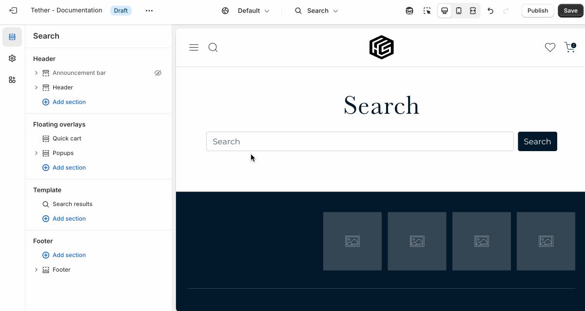
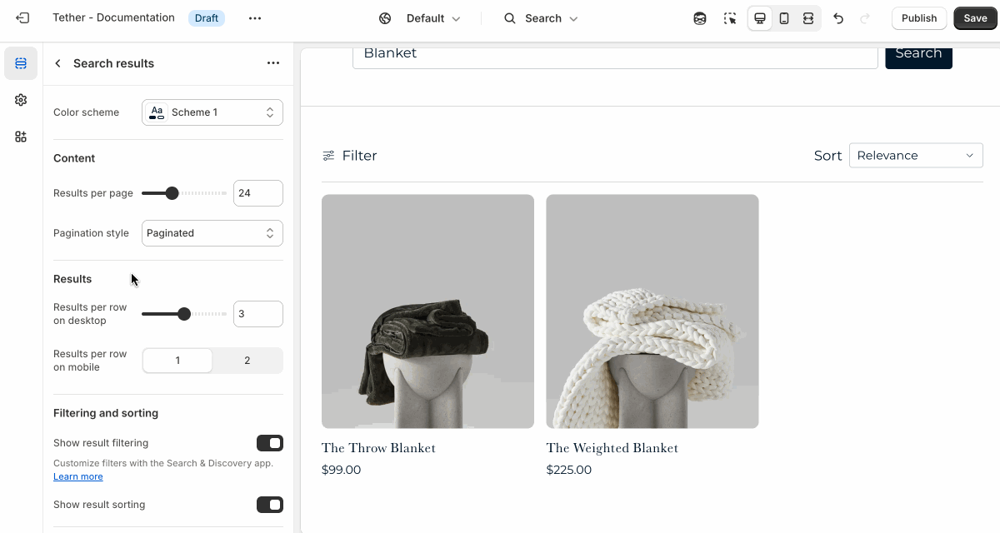

# Search template

The Search template displays results when a customer uses your store’s search feature. It shows matching products, collections, blog posts, or pages based on the search term entered. You can customize this template to include filters, sorting options, or messaging to help customers quickly find what they’re looking for.

:::tip Quick search
If the [Quick search](#TODO) is enabled users will be able to actively search within the header without needed to visit this template. This template is still visible to people looking for full results beyond what is shown in the Quick search results.
:::

## Search results section

| Setting               | Description                                                                 |
|------------------------|-----------------------------------------------------------------------------|
| **Color scheme**         | Select a predefined color scheme. |
| **Content**         | [See all Content settings](#content-settings) |
| **Results**         | [See all Results settings](#results-settings) |
| **Filtering and sorting**         | [See all Filtering and sorting settings](#filtering-and-sorting-settings) |
| **Section spacing & border**     | [See shared settings > Section spacing & border](#spacing-and-border). Associated settings below.                    |
| **Section animations**     | Animate section when scrolled into view.                    |

---

### Content settings

| Setting               | Description                                                                 |
|------------------------|-----------------------------------------------------------------------------|
| **Results per page**         | How many search results are visible on each paginated page. |
| **Pagination style**         | Choose how customers navigate through results beyond the current page.  |

:::tip Pagination style
This setting helps you control how content loads, based on the experience you want to create.

* **Paginated**: Shows numbered pages for manual navigation.
* **Click to load more**: Loads more results when a button is clicked.
* **Load on scroll**: Automatically loads more results as the customer scrolls (infinite scroll).
:::

### Results settings

| Setting               | Description                                                                 |
|------------------------|-----------------------------------------------------------------------------|
| **Results per row on desktop**         | Pick how many results are visible in a row on desktop |
| **Results per row on mobile**         | Pick how many results are visible in a row on mobile |

### Filtering and sorting settings

| Setting               | Description                                                                 |
|------------------------|-----------------------------------------------------------------------------|
| **Show result filtering**         | Allow users to filter and refine the results shown through the filter panel. |
| **Show result sorting**         | Allow users to update the order of results shown. |
| **Group active filters by type**         | When filters are applied and the filter panel is closed, active filters appear as dismissable filter buttons. Enabling grouping will organize these buttons by filter type. Making it easier for customers to see what categories or options they’ve selected. |

import SharedSettings from '../_shared-settings/_shared-settings.md'

<SharedSettings />

import SpacingAndBorder from '../_shared-settings/_spacing-and-border.mdx';

<SpacingAndBorder />