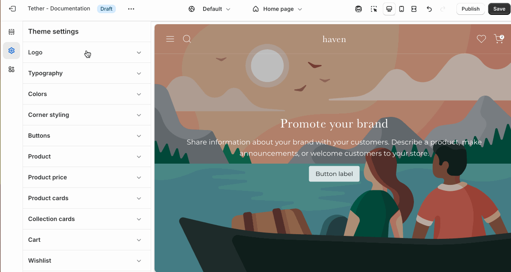

# Logo

Upload your store’s primary branding assets, including your main logo, a transparent version for use on dark or image backgrounds, and your site’s favicon. Logos are used across key areas of your store like the header, drawer menu, and password page. This helps ensure a consistent, professional brand presence throughout the customer experience.

## Settings

| Setting               | Description                                                                 |
|------------------------|-----------------------------------------------------------------------------|
| **Logo**         | Upload your main logo to be displayed in the header, drawer menu, and other areas of your store. This version is typically used on light backgrounds. |
| **Transparent logo**         | Upload a version of your logo with a transparent or light-colored design for use when the header is transparent. |
| **Desktop max width**         | Set the width of your logo for desktop size screens. |
| **Mobile max width**         | Set the width of your logo for mobile size screens. |
| **Favicon image**         | Upload a small icon to represent your store in browser tabs, bookmarks, and mobile shortcuts. This helps reinforce your branding and makes your site easier to recognize at a glance. |

