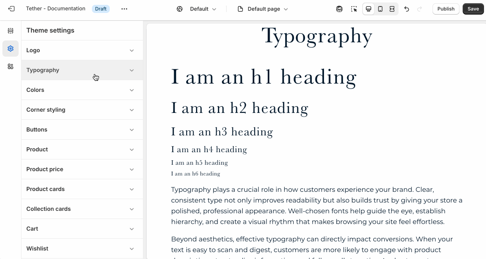
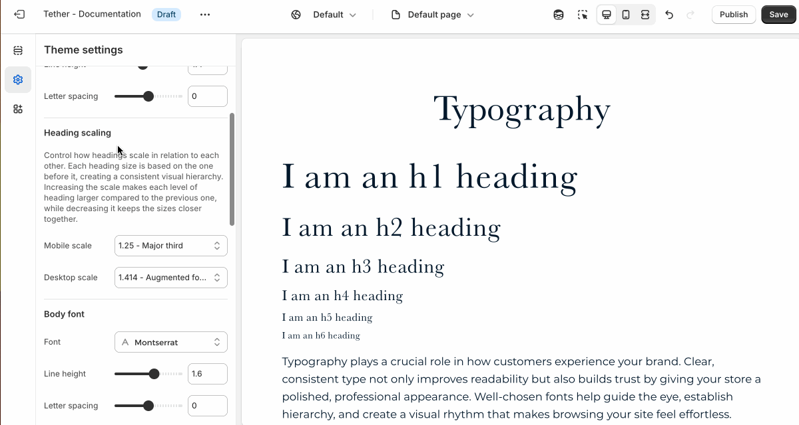
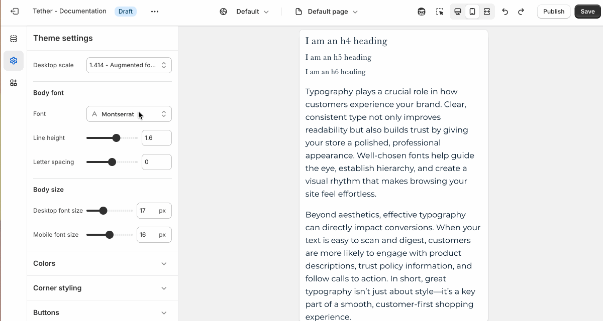
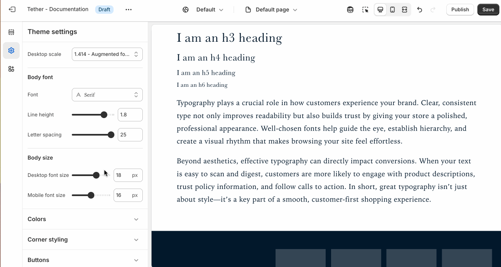

# Typography

Customize the overall look and feel of your store’s text with global typography controls. Choose fonts for body text and headings, adjust font sizes, line height, and letter spacing to improve readability and visual balance.

## Heading font settings

| Setting               | Description                                                                 |
|------------------------|-----------------------------------------------------------------------------|
| **Font**         | Select the typeface used for your store’s headings. |
| **Line height**         | Adjust the vertical spacing between lines of your headings. |
| **Letter spacing**         | Control the space between individual characters. Tweaking letter spacing can improve legibility and give your text a more refined, intentional look. |

## Heading scaling settings

Control how headings scale in relation to each other. Each heading size is based on the one before it, creating a consistent visual hierarchy. Increasing the scale makes each level of heading larger compared to the previous one, while decreasing it keeps the sizes closer together.

Heading scaling is also corelated to the [Body font size](#body-size).

| Setting               | Description                                                                 |
|------------------------|-----------------------------------------------------------------------------|
| **Mobile scale**         | Set your heading typescale for mobile sizes screens. |
| **Desktop scale**         | Set your heading typescale for desktop sizes screens. |

:::tip
For a smooth, consistent experience across devices, avoid setting desktop and mobile heading scales too far apart. Keeping the sizes relatively close helps maintain visual balance and prevents awkward jumps in layout or readability.
:::

## Heading font settings

| Setting               | Description                                                                 |
|------------------------|-----------------------------------------------------------------------------|
| **Font**         | Select the typeface used for your store’s body text. |
| **Line height**         | Adjust the vertical spacing between lines of your body text. |
| **Letter spacing**         | Control the space between individual characters. Tweaking letter spacing can improve legibility and give your text a more refined, intentional look. |

## Body size

Set the base font size for body text on desktop and mobile. Sizes will adjust fluidly accross devices, creating a smooth and responsive reading experience across all screen sizes.

| Setting               | Description                                                                 |
|------------------------|-----------------------------------------------------------------------------|
| **Desktop font size**         | Adjust the base desktop font size. |
| **Mobile font size**         | Adjust the base mobile font size. |

