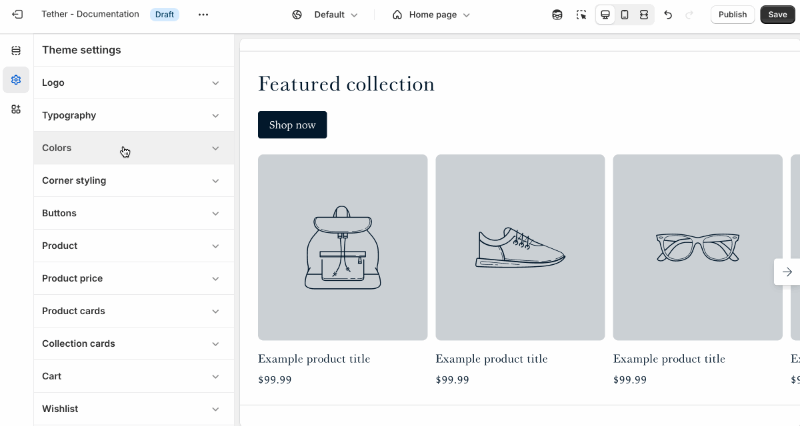
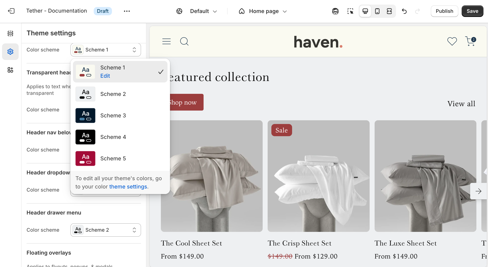
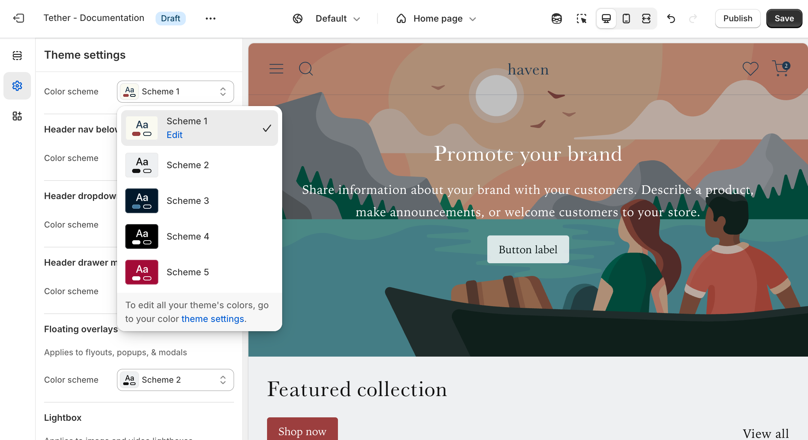
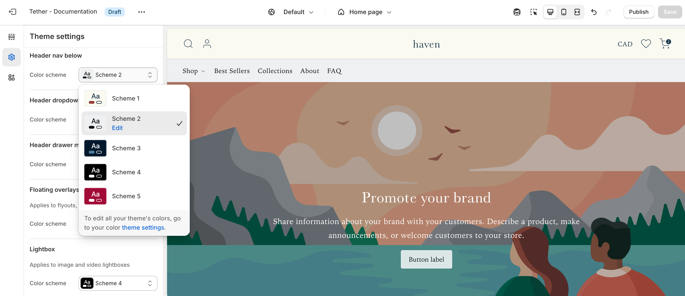
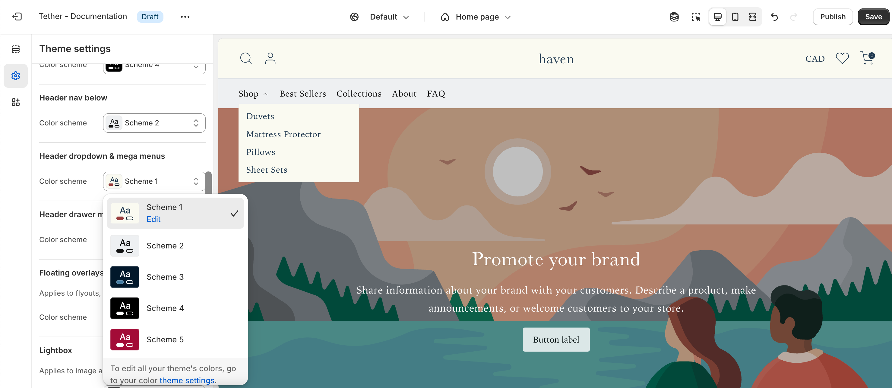
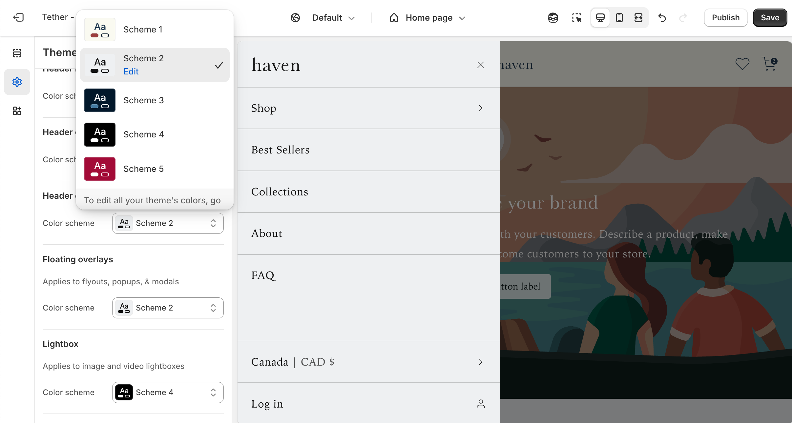
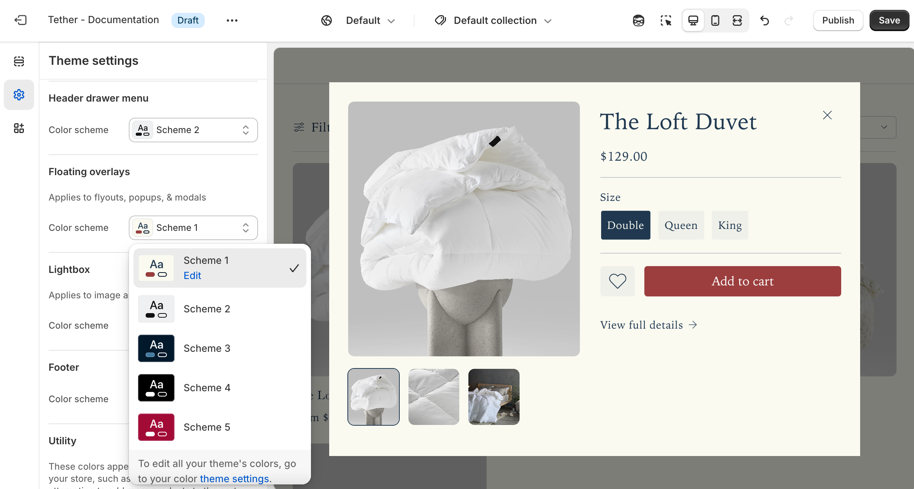
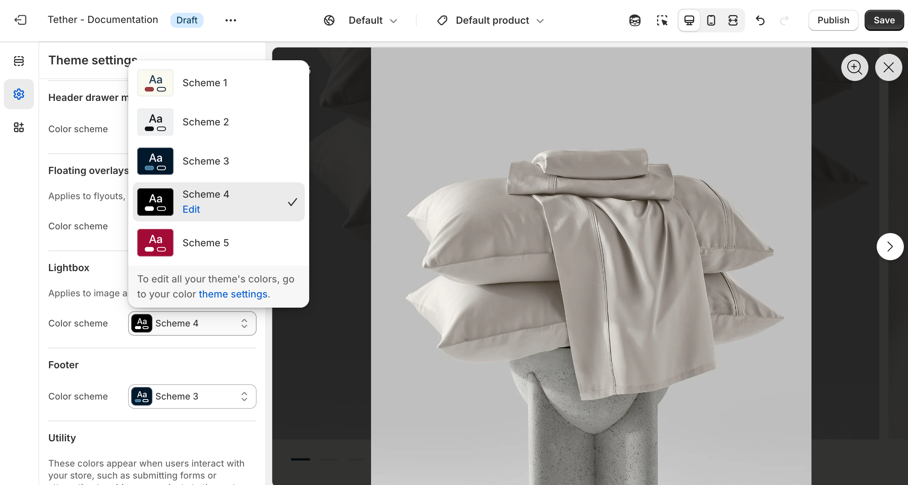

# Colors

Customize your store’s look and feel using flexible color schemes. Instead of choosing individual colors for each element, sections and components are styled using predefined schemes that ensure consistent, balanced color pairings across your storefront. This makes it easy to maintain a cohesive design while giving you the flexibility to update your brand’s palette in just a few clicks.

## Color schemes

Each color scheme includes the following customizable color roles:

| Color    | Description                            |
|-----------------------------|-------------------------------------------------|
| **Background**              | The main background color used wherever the scheme is applied.              |
| **Background Gradient**     | An optional gradient overlay for the background. Available in select sections to add visual depth and color emphasis. |
| **Text**                    | The primary foreground color used for text, icons, and borders.             |
| **Primary Button Background** | The background color for primary buttons throughout your store.             |
| **Primary Button Text**     | The text color used on primary buttons. Ensures clear contrast and readability. |
| **Secondary Button Color**  | The color used for secondary (outline) buttons—applied to both text and borders. |

## Accent colors

Accent colors highlight your brand’s identity and add emphasis to key elements. These colors are applied across all color schemes, and can be enabled within any section. This ensures consistency without having to repeat your brand colors in every scheme.

## Global schemes

Although the majority of all sections have the ability to set color schemes, some are applied globally from the theme settings. The following settings will apply across the entire theme.

### Header
Applies to the base header and the password header on the Password Template.

### Transparent header
Applies to the transparent header if enabled in the Header section or the Password header section.

### Header nav below
Applies at desktop screen sizes if the Header section is set to 'Navigation position' -> 'Below'.

### Header dropdown & mega menus
Applies to all Header dropdowns if nested menus exist in the displayed menu, or in Mega menus if add as a Header block.

### Header drawer menu
Applies to the Headers menu drawer, visible at non desktop sized screens or if Header section is set to 'Desktop navigation display' -> 'Drawer'.

### Floating overlays
Applies to all flyouts, popups, and modals, including product card Quick add popups, and the Collection template Filter flyout.

### Lightbox
Applies to the lightbox visible when interacting with product images.

## Utility colors

These colors appear when users interact with your store, such as submitting forms or recieiving errors when trying to add more products to the cart than are physically in stock.

| Color    | Description                            |
|-----------------------------|-------------------------------------------------|
| **Success**              | Associated with positive messaging. Form successfuly submitted.              |
| **Error**     | Associated with negative messaging. Form has errors. |