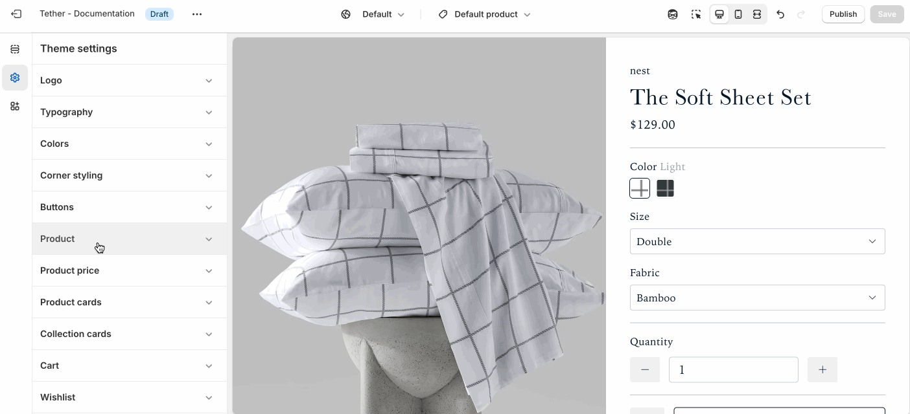

# Product
Customize how customers interact with product options on the Product page, and in the Featured product section.

## Swatch selectors

Swatch selectors let shoppers quickly preview and select product variants using color pattern selectors instead of traditional dropdown menus. [Learn more about setting up Swatches with Category metafields](https://help.shopify.com/en/manual/custom-data/metafields/category-metafields/using-category-metafields).

| Setting               | Description                                                                 |
|------------------------|-----------------------------------------------------------------------------|
| **Shape**         | Choose to display your swatches as either round or square (Corner styling applies). |

## Chip selectors

Chip selectors display product variant options—like size, material, or style—as clickable buttons. They’re clean, easy to scan, and ideal for text-based choices. Chip selectors help customers quickly understand what’s available and make selections without using dropdowns.

| Setting               | Description                                                                 |
|------------------------|-----------------------------------------------------------------------------|
| **Variant option for chips**         | Select which variant option will display as chips. Add one variant option per line, the input is case sensative.  |