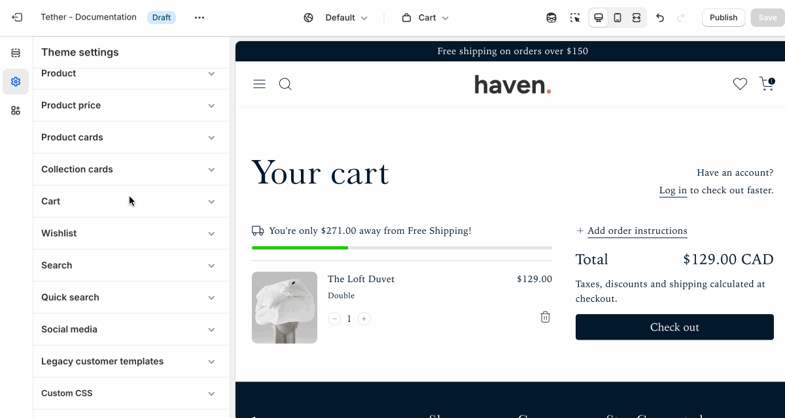

# Cart

These settings are shared accross the Quick cart and the Cart template.

## Cart note

Allow customers to leave a note with their order, such as special instructions or gift messages. Enabling this setting adds a text field to the cart for easy input before checkout.

| Setting               | Description                                                                 |
|------------------------|-----------------------------------------------------------------------------|
| **Show cart note**         | Add the ability for users to add a note to the cart. |

## Free shipping bar

Display a message in the cart that encourages customers to reach a free shipping threshold. As items are added, the message updates to show how close they are to qualifying—helping boost average order value. The free shipping bar requires a custom Metaobject to setup the threshold, view the step by step tutorial [here](/getting-started/setting-up-the-free-shipping-metaobject).

| Setting               | Description                                                                 |
|------------------------|-----------------------------------------------------------------------------|
| **Show free shipping bar**         | Show a free shipping bar in the cart to encourage to reach free shipping. Free shipping Metaobject must be setup. |
| **Progress bar color**         | Choose a color to show for your progress bar. |
| **Icon**         | Select an icon to show with your free shipping message. |

