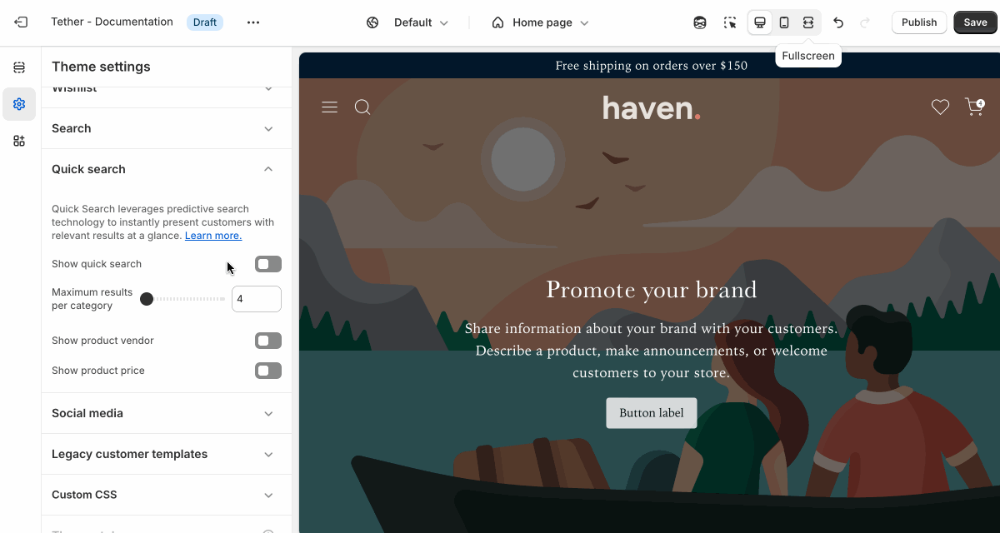

# Quick search

The Quick search provides instant search results as customers type, helping them find products, collections, or pages faster. Results appear in a dropdown below the search field, allowing shoppers to quickly jump to relevant content without leaving the current page.

:::note
If the Quick search is disabled, clicking on the search icon in the header will redirect the user to the Search template.
:::

| Setting               | Description                                                                 |
|------------------------|-----------------------------------------------------------------------------|
| **Show quick search**         | Enable or disable the Quick search. |
| **Maximum results per category**         | Control how many results are shown for each category. Categories can be further refined using Shopify's [Search & Discovery App](https://apps.shopify.com/search-and-discovery).  |
| **Show product vendor**         | Display the associated vendor within result product cards. |
| **Show product price**         | Show the product price within result product cards. |

